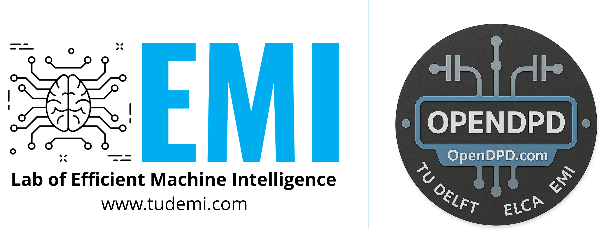

**OpenDPD** is an end-to-end learning framework built in PyTorch for modeling power amplifiers (PA) and digital pre-distortion. Developed by the [Lab of Efficient Machine Intelligence](https://www.tudemi.com) @ Delft University of Technology, OpenDPD now ships as both a pip-installable package and a full research codebase.
- `pip install opendpd` exposes high-level Python APIs (`train_pa`, `train_dpd`, `create_dataset`, etc.) and an `opendpd-cli` entry point for quick experiments.
- The repository provides automation scripts, dataset tooling, quantization utilities, and reproducible baselines for RF researchers.
- Documentation includes rich examples (Python scripts + Jupyter notebooks) and detailed setup instructions for advanced users.

We invite you to contribute new backbone networks, pre-trained models, or measured PA datasets. This repository contains the complete training pipeline for OpenDPD using baseband signals from digital transmitters.

# Quick Start
Start with the Google Colab tutorial by clicking the badge below for a zero-install guided walkthrough of OpenDPD’s workflow.

[](https://colab.research.google.com/drive/1o5X8hztWyMKaMhPs2gUf2fZABCq2nUjn?usp=sharing)

# Demo Video
Watch our [Demo Video](https://youtu.be/n3765lm3QZI) to see a real OpenDPDv2-trained neural DPD model in action achieving close to -60 dBc ACPR on a 200 MHz 256-QAM 5G NR signal with a -41.5 dBm average output power GaN PA.

[](https://youtu.be/n3765lm3QZI)


# Version Update
**OpenDPDv2** embeds a new temporal residual (TRes)-DeltaGRU NN DPD algorithm and a new TM3.1a 5-channel x 40 MHz (200 MHz) test signal dataset, measured from a 3.5 GHz Ampleon GaN PA at 41.5 dBm average output power, named APA_200MHz, enabling fast prototyping of accurate and power-efficient NN-based DPD algorithms by streamlining learning and optimization through DPD quantization and temporal sparsity exploitation.
| Version    | Related Papers|Dataset                                      |    Supported Backbones      | Performance <br> on APA_200MHz
|------------|----|-------------------|----------------------|---------|
| OpenDPDv1 | Algorithms <br>  [](https://ieeexplore.ieee.org/abstract/document/10558162) <br> [](https://ieeexplore.ieee.org/document/10502240) <br> [](https://ieeexplore.ieee.org/abstract/document/11006082) <br> [](https://www.arxiv.org/abs/2506.12165) <br> Hardware [](https://ieeexplore.ieee.org/document/11043563) <br> [](https://arxiv.org/abs/2506.16591)|Collected from a 40nm CMOS DTX @ 2.4 GHz<br>DPA_100MHz,<br>DPA_160MHz,<br>DPA_200MHz | GRU,<br>LSTM,<br>GMP,<br>RVTDCNN, <br>VDLSTM,<br> DGRU,<br> TCN        | DGRU with 1041 params: <br> ACPR of -58.4 dBc, <br> EVM of -39.1 dB|
| OpenDPDv2  |   [](https://arxiv.org/abs/2507.06849)|Collected from a GaN Doherty @ 3.5 GHz<br>APA_200MHz,<br>APA_200MHz_b |  PGJANET,<br>DVRJANET,<br>TRes-DeltaGRU | TRes-DeltaGRU with 996 params: <br> ACPR of -59.4 dBc, <br> EVM of -42.1 dB|
|Experiment code|[](https://arxiv.org/abs/2507.06849)[](https://ieeexplore.ieee.org/author/37088931208)| Controlling, <br>I/Q data upload/download MATLAB code | Rohde & Schwarz SMW200A, <br> Keysight N9042B,| Matlab/.m 


# Advanced Usage (From Source)

## Repository Layout
```
.
├── backbones/       # Neural backbone implementations
├── bash_scripts/    # Batch experiment scripts (train_all_*.sh, quant_*.sh)
├── datasets/        # Built-in PA datasets (CSV + spec.json)
├── examples/        # API examples and tutorials
├── modules/         # Data pipeline, logging, and training utilities
├── opendpd/         # Python package exposing the high-level API
├── quant/           # Quantization-aware training components
├── steps/           # CLI entry points (train_pa, train_dpd, run_dpd)
├── utils/           # Miscellaneous helper functions
├── Makefile         # Convenience targets (install, clean, etc.)
├── main.py          # Legacy CLI entry mirrored by opendpd-cli
└── project.py       # Core configuration & training orchestration
```

## Environment Setup

This project has been tested with PyTorch 2.6 and Ubuntu 24.04 LTS.

### Setting Up Your Environment

We recommend using Miniconda for environment management:

```bash
# Install Miniconda (Linux)
wget https://repo.anaconda.com/miniconda/Miniconda3-latest-Linux-x86_64.sh
chmod +x Miniconda3-latest-Linux-x86_64.sh
./Miniconda3-latest-Linux-x86_64.sh

# For MacOS, use:
# wget https://repo.anaconda.com/miniconda/Miniconda3-latest-MacOSX-arm64.sh

# Create a Python environment with required packages
conda create -n opendpd python=3.13 numpy scipy pandas matplotlib tqdm rich
conda activate opendpd
```

### Installing PyTorch

For **Linux or Windows** systems:
- With CPU only:
  ```bash
  pip3 install torch torchvision torchaudio
  ```
- With NVIDIA GPU (CUDA 12.6):
  ```bash
  pip3 install torch torchvision torchaudio --index-url https://download.pytorch.org/whl/cu126
  ```
  Note: Ensure you have the latest NVIDIA GPU drivers installed to support CUDA 12.6

For **macOS** systems:
```bash
pip3 install torch torchvision torchaudio
```

# End-to-End (E2E) Training

This section introduces the End-to-End learning architecture and how to execute each component using command-line instructions.

 

The E2E learning framework consists of three main components:

**1. Data Acquisition & Pre-Processing:** 
This phase involves collecting and preprocessing baseband I/Q signals from the Power Amplifier (PA). To reduce gradient vanishing and enhance training effectiveness, we segment the raw data into shorter frames. The dataset includes signal measurements at various bandwidths from a digital transmitter. Data is partitioned in an 8:2:2 ratio for training, testing, and validation.

**2. PA Modeling:** 
This step trains a behavioral model of the PA using framed input and target output pairs through sequence-to-sequence learning. We employ Backpropagation Through Time (BPTT) for optimization.

Command line for PA modeling (use `--accelerator cuda` for NVIDIA GPU acceleration or `--accelerator mps` for Apple Silicon GPU acceleration):
```bash
python main.py --dataset_name DPA_200MHz --step train_pa --accelerator cpu
```

**3. DPD Learning:** 
Here, we integrate a Digital Pre-Distortion (DPD) model before the pre-trained PA behavioral model. The input signal feeds into the cascaded model, and through BPTT, we align the output signal with the amplified linear input signal. In OpenDPDv2, we add the deltarnn backbones for temporally-sparse DPD learning.

Command line for DPD learning:
```bash
python main.py --dataset_name DPA_200MHz --step train_dpd --accelerator cpu
```
**4. Quantization-Aware Learning:** 
Quantization-Aware is a technique for training fixed-point quantized DPD models without significantly compromising accuracy, enabling efficient hardware implementation. 

```bash
# 16-bit Quantization example
# Replace ${pretrained_model_from_previous_step} with the path to your pretrained model
# Replace ${label_for_quantized_model} with your desired label for the quantized model
python main.py --dataset_name DPA_200MHz --step train_dpd --accelerator cpu --DPD_backbone qgru --quant --n_bits_w 16 --n_bits_a 16 --pretrained_model ${pretrained_model_from_previous_step} --quant_dir_label ${label_for_quantized_model}
```

**5. Validation Experiment:** 
To assess the DPD model's performance, we generate an ideal input signal after training. The resulting signal is stored in CSV format in the `run_dpd` directory.

Command line for validation:
```bash
python main.py --dataset_name DPA_200MHz --step run_dpd --accelerator cpu
```
Command line for validation with quantization:
```bash
# Ensure ${label_for_quantized_model} matches what you used in step 4
python main.py --dataset_name DPA_200MHz --step run_dpd --accelerator cpu --DPD_backbone qgru --quant --n_bits_w 16 --n_bits_a 16 --quant_dir_label ${label_for_quantized_model}
```

## Enhanced Visualization with Rich Tables

OpenDPD features advanced progress visualization using Rich tables, displaying training metrics in an organized, colorful format:

- Left table: General information about the training run
- Right table: Training, validation, and test metrics with consistent formatting

You can adjust the decimal precision for metric display using the `--log_precision` parameter:
```bash
python main.py --dataset_name DPA_200MHz --step train_pa --log_precision 4
```

## Reproducing Published Results

### OpenDPDv1
To reproduce the PA modeling results shown in **OpenDPD** Figure 4(a):
```bash
bash bash_scripts/train_all_pa.sh
```
This script trains multiple PA models (each with approximately 500 parameters) using 5 different random seeds. Figure 4(a) displays the averaged results from these runs.

To reproduce the DPD learning results in Figure 4(b), Figure 4(d), and Table 1:
```bash
bash bash_scripts/train_all_dpd.sh
```
This script trains various DPD models, each with approximately 500 parameters.

### Mixed-Precision DPD (MP-DPD)

For convenience, you can reproduce all MP-DPD results using:
```bash
bash bash_scripts/quant_mp_dpd.sh
```

### OpenDPDv2
To reproduce the quantized (W16A16) TRes-DeltaGRU-450 DPD modeling results shown in **OpenDPDv2** Table 1:
```bash
bash bash_scripts/OpenDPDv2.sh
```

# Experimental Setup
 


# Authors & Citation
If you find this repository helpful, please cite our work:
- [ISCAS 2024] [OpenDPD: An Open-Source End-to-End Learning & Benchmarking Framework for Wideband Power Amplifier Modeling and Digital Pre-Distortion](https://ieeexplore.ieee.org/abstract/document/10558162)
```
@INPROCEEDINGS{Wu2024ISCAS,
  author={Wu, Yizhuo and Singh, Gagan Deep and Beikmirza, Mohammadreza and de Vreede, Leo C. N. and Alavi, Morteza and Gao, Chang},
  booktitle={2024 IEEE International Symposium on Circuits and Systems (ISCAS)}, 
  title={OpenDPD: An Open-Source End-to-End Learning & Benchmarking Framework for Wideband Power Amplifier Modeling and Digital Pre-Distortion}, 
  year={2024},
  volume={},
  number={},
  pages={1-5},
  keywords={Codes;Transmitters;OFDM;Power amplifiers;Artificial neural networks;Documentation;Benchmark testing;digital pre-distortion;behavioral modeling;deep neural network;power amplifier;digital transmitter},
  doi={10.1109/ISCAS58744.2024.10558162}}
```
- [IMS/MWTL 2024] [MP-DPD: Low-Complexity Mixed-Precision Neural Networks for Energy-Efficient Digital Pre-distortion of Wideband Power Amplifiers](https://ieeexplore.ieee.org/document/10502240)
```
@ARTICLE{Wu2024IMS,
  author={Wu, Yizhuo and Li, Ang and Beikmirza, Mohammadreza and Singh, Gagan Deep and Chen, Qinyu and de Vreede, Leo C. N. and Alavi, Morteza and Gao, Chang},
  journal={IEEE Microwave and Wireless Technology Letters}, 
  title={MP-DPD: Low-Complexity Mixed-Precision Neural Networks for Energy-Efficient Digital Predistortion of Wideband Power Amplifiers}, 
  year={2024},
  volume={},
  number={},
  pages={1-4},
  keywords={Deep neural network (DNN);digital predistortion (DPD);digital transmitter (DTX);power amplifier (PA);quantization},
  doi={10.1109/LMWT.2024.3386330}}
```
- [IMS/MWTL 2025] [DeltaDPD: Exploiting Dynamic Temporal Sparsity in Recurrent Neural Networks for Energy-Efficient Wideband Digital Predistortion](https://ieeexplore.ieee.org/abstract/document/11006082/)
```
@article{Wu2025MWTL,
   title={DeltaDPD: Exploiting Dynamic Temporal Sparsity in Recurrent Neural Networks for Energy-Efficient Wideband Digital Predistortion},
   ISSN={2771-957X},
   url={http://dx.doi.org/10.1109/LMWT.2025.3565004},
   DOI={10.1109/lmwt.2025.3565004},
   journal={IEEE Microwave and Wireless Technology Letters},
   publisher={Institute of Electrical and Electronics Engineers (IEEE)},
   author={Wu, Yizhuo and Zhu, Yi and Qian, Kun and Chen, Qinyu and Zhu, Anding and Gajadharsing, John and de Vreede, Leo C. N. and Gao, Chang},
   year={2025},
   pages={1–4} }
```
# Contributors

- **Chang Gao** - Project Lead
- **Yizhuo Wu** - Core Developer
- **Ang Li** - Core Developer
- **Huanqiang Duan** - Contributor
- **Ruishen Yang** - Contributor
- **Qian Wu (qian.wu@ucdconnect.ie)** - Contributor

# FAQs

**Q: The discrepancy between spec.json of APA_200MHz and the reported signal configuration in our paper.**

**A:**
The reported signal configuration in our paper — TM3.1a, 5×40 MHz (200 MHz) 256-QAM with a sampling rate of 983.04e6 Hz — is accurate. We used the spec.json file as shown in this repository because of the complexity involved in demodulating 5G NR signals.

As illustrated in the figure, the structure of a 5G NR test signal is:

Generating a multi-channel 5G NR standard test signal is even more complex. In particular, handling cyclic prefix variations requires calling MATLAB functions from Python, which would introduce unnecessary barriers for reproduction. For this reason, we currently employ the simplest demodulation approach (direct FFT) in metrics simulations.

Impact on simulation results:

i. For signals such as APA_200MHz, splitting segments at inappropriate positions may lead to incorrect ACPR calculations. To avoid this, we set spec.json to a single 200 MHz channel, preventing signal splitting errors during metrics evaluation.

ii. This approach produces relatively accurate simulated ACPR and NMSE results, but some inaccuracy in EVM remains.

iii. For the constellation maps provided in deltadpd and opendpdv2, we include a dedicated MATLAB script for demodulation (calculate_200MHz_256QAM_evm.m). However, note that this script applies only to this specific signal and is not generalizable.

iv. In future releases, we plan to: Provide a separate branch that integrates MATLAB functions directly into Python workflows and release additional signal generation–demodulation chains wherever feasible.
