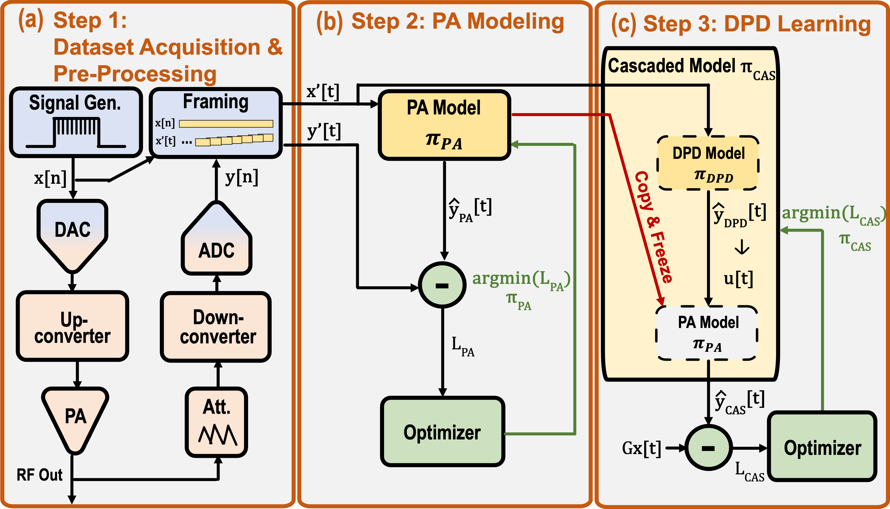

**OpenDPD** is an end-to-end learning framework built in PyTorch for modeling power amplifiers (PA) and digital pre-distortion. Developed by the [Lab of Efficient Machine Intelligence](https://www.tudemi.com) @ Delft University of Technology, OpenDPD aims to bridge the gap between machine learning and RF system optimization.

The framework provides a comprehensive solution for training neural network models that accurately characterize PA behavior and implement digital pre-distortion to improve linearity and efficiency. By leveraging state-of-the-art deep learning techniques, OpenDPD enables researchers and engineers to develop more energy-efficient wireless communication systems.

We invite you to contribute to this project by providing your own backbone neural networks, pre-trained models, or measured PA datasets. This repository contains the complete training pipeline for OpenDPD using baseband signals from digital transmitters.

# Project Structure
```
.
└── backbone        # Configuration files for feature extractors and other components
└── datasets        # Measured PA datasets
    └──DPA_200MHz   └── # Digital Power Amplifier with 200 MHz OFDM Signals
└── dpd_out         # Output files (automatically generated)
└── log             # Experimental log data (automatically generated)
└── modules         # Major functional modules
└── save            # Saved models
└── steps           # Implementation steps (train_pa, train_dpd, run_dpd)
└── utils           # Utility libraries
└── argument.py     # Command-line arguments and configuration
└── main.py         # Main entry point
└── model.py        # Top-level neural network models
└── project.py      # Core class for hyperparameter management and utilities

```

# Environment Setup

This project has been tested with PyTorch 2.6 and Ubuntu 24.04 LTS.

### Setting Up Your Environment

We recommend using Miniconda for environment management:

```bash
# Install Miniconda (Linux)
wget https://repo.anaconda.com/miniconda/Miniconda3-latest-Linux-x86_64.sh
chmod +x Miniconda3-latest-Linux-x86_64.sh
./Miniconda3-latest-Linux-x86_64.sh

# For MacOS, use:
# wget https://repo.anaconda.com/miniconda/Miniconda3-latest-MacOSX-arm64.sh

# Create a Python environment with required packages
conda create -n opendpd python=3.13 numpy scipy pandas matplotlib tqdm rich
conda activate opendpd
```

### Installing PyTorch

For **Linux or Windows** systems:
- With CPU only:
  ```bash
  pip3 install torch torchvision torchaudio
  ```
- With NVIDIA GPU (CUDA 12.6):
  ```bash
  pip3 install torch torchvision torchaudio --index-url https://download.pytorch.org/whl/cu126
  ```
  Note: Ensure you have the latest NVIDIA GPU drivers installed to support CUDA 12.6

For **macOS** systems:
```bash
pip3 install torch torchvision torchaudio
```

# End-to-End (E2E) Training

This section introduces the End-to-End learning architecture and how to execute each component using command-line instructions.

 

The E2E learning framework consists of three main components:

**1. Data Acquisition & Pre-Processing:** 
This phase involves collecting and preprocessing baseband I/Q signals from the Power Amplifier (PA). To reduce gradient vanishing and enhance training effectiveness, we segment the raw data into shorter frames. The dataset includes signal measurements at various bandwidths from a digital transmitter. Data is partitioned in an 8:2:2 ratio for training, testing, and validation.

**2. PA Modeling:** 
This step trains a behavioral model of the PA using framed input and target output pairs through sequence-to-sequence learning. We employ Backpropagation Through Time (BPTT) for optimization.

Command line for PA modeling (use `--accelerator cuda` for NVIDIAGPU acceleration):
```bash
python main.py --dataset_name DPA_200MHz --step train_pa --accelerator cpu
```

**3. DPD Learning:** 
Here, we integrate a Digital Pre-Distortion (DPD) model before the pre-trained PA behavioral model. The input signal feeds into the cascaded model, and through BPTT, we align the output signal with the amplified linear input signal.

Command line for DPD learning:
```bash
python main.py --dataset_name DPA_200MHz --step train_dpd --accelerator cpu
```

**4. Validation Experiment:** 
To assess the DPD model's performance, we generate an ideal input signal after training. The resulting signal is stored in CSV format in the `run_dpd` directory.

Command line for validation:
```bash
python main.py --dataset_name DPA_200MHz --step run_dpd --accelerator cpu
```

## Enhanced Visualization with Rich Tables

OpenDPD features advanced progress visualization using Rich tables, displaying training metrics in an organized, colorful format:

- Left table: General information about the training run
- Right table: Training, validation, and test metrics with consistent formatting

You can adjust the decimal precision for metric display using the `--log_precision` parameter:
```bash
python main.py --dataset_name DPA_200MHz --step train_pa --log_precision 4
```

## Reproducing Published Results

### PA Modeling Results
To reproduce the PA modeling results shown in **OpenDPD** Figure 4(a):
```bash
bash train_all_pa.sh
```
This script trains multiple PA models (each with approximately 500 parameters) using 5 different random seeds. Figure 4(a) displays the averaged results from these runs.

### DPD Learning Results
To reproduce the DPD learning results in Figure 4(b), Figure 4(d), and Table 1:
```bash
bash train_all_dpd.sh
```
This script trains various DPD models, each with approximately 500 parameters.

## Mixed-Precision DPD (MP-DPD)

MP-DPD is a technique for training fixed-point quantized DPD models without significantly compromising accuracy, enabling efficient hardware implementation. Follow these steps to reproduce the MP-DPD results:

1. **Pretrain a DPD Model**:
```bash
python main.py --dataset_name DPA_200MHz --step train_dpd --accelerator cpu --DPD_backbone qgru --quant --q_pretrain True
```

2. **Apply Quantization-Aware Training**:
```bash
# 16-bit Quantization example
# Replace ${pretrained_model_from_previous_step} with the path to your pretrained model
# Replace ${label_for_quantized_model} with your desired label for the quantized model
python main.py --dataset_name DPA_200MHz --step train_dpd --accelerator cpu --DPD_backbone qgru --quant --n_bits_w 16 --n_bits_a 16 --pretrained_model ${pretrained_model_from_previous_step} --quant_dir_label ${label_for_quantized_model}
```

3. **Generate Output from the Quantized Model**:
```bash
# Ensure ${label_for_quantized_model} matches what you used in step 2
python main.py --dataset_name DPA_200MHz --step run_dpd --accelerator cpu --DPD_backbone qgru --quant --n_bits_w 16 --n_bits_a 16 --quant_dir_label ${label_for_quantized_model}
```

For convenience, you can reproduce all MP-DPD results using:
```bash
bash quant_mp_dpd.sh
```

# Authors & Citation
If you find this repository helpful, please cite our work:
- [ISCAS 2024] [OpenDPD: An Open-Source End-to-End Learning & Benchmarking Framework for Wideband Power Amplifier Modeling and Digital Pre-Distortion](https://ieeexplore.ieee.org/abstract/document/10558162)
```
@INPROCEEDINGS{Wu2024ISCAS,
  author={Wu, Yizhuo and Singh, Gagan Deep and Beikmirza, Mohammadreza and de Vreede, Leo C. N. and Alavi, Morteza and Gao, Chang},
  booktitle={2024 IEEE International Symposium on Circuits and Systems (ISCAS)}, 
  title={OpenDPD: An Open-Source End-to-End Learning & Benchmarking Framework for Wideband Power Amplifier Modeling and Digital Pre-Distortion}, 
  year={2024},
  volume={},
  number={},
  pages={1-5},
  keywords={Codes;Transmitters;OFDM;Power amplifiers;Artificial neural networks;Documentation;Benchmark testing;digital pre-distortion;behavioral modeling;deep neural network;power amplifier;digital transmitter},
  doi={10.1109/ISCAS58744.2024.10558162}}
```
- [IMS/MWTL 2024] [MP-DPD: Low-Complexity Mixed-Precision Neural Networks for Energy-Efficient Digital Pre-distortion of Wideband Power Amplifiers](https://ieeexplore.ieee.org/document/10502240)
```
@ARTICLE{Wu2024IMS,
  author={Wu, Yizhuo and Li, Ang and Beikmirza, Mohammadreza and Singh, Gagan Deep and Chen, Qinyu and de Vreede, Leo C. N. and Alavi, Morteza and Gao, Chang},
  journal={IEEE Microwave and Wireless Technology Letters}, 
  title={MP-DPD: Low-Complexity Mixed-Precision Neural Networks for Energy-Efficient Digital Predistortion of Wideband Power Amplifiers}, 
  year={2024},
  volume={},
  number={},
  pages={1-4},
  keywords={Deep neural network (DNN);digital predistortion (DPD);digital transmitter (DTX);power amplifier (PA);quantization},
  doi={10.1109/LMWT.2024.3386330}}
```

# Contributors

- **Chang Gao** - Project Lead
- **Yizhuo Wu** - Core Developer
- **Ang Li** - Core Developer
- **Huanqiang Duan** - Contributor
- **Ruishen Yang** - Contributor
