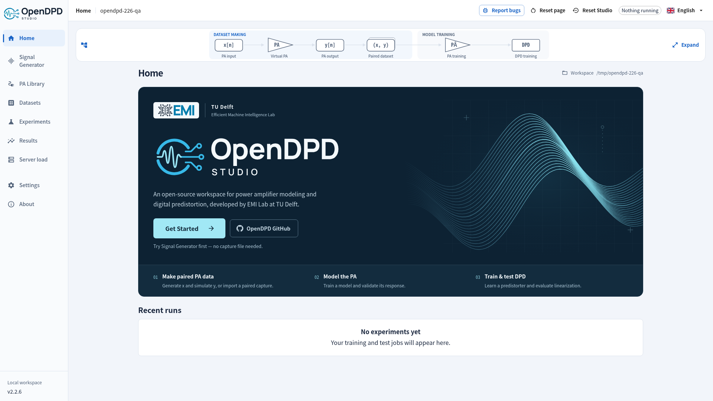
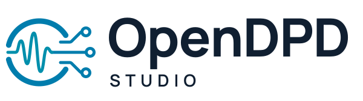

<!-- --8<-- [start:hero] -->

<!-- --8<-- [end:hero] -->

# OpenDPD

<!-- --8<-- [start:brand] -->
<p>
  <a href="https://github.com/lab-emi/OpenDPD"><picture class="brand-logo"><source
    media="(prefers-color-scheme: dark)" srcset="frontend/src/assets/opendpd-studio-logo-inverse.svg" /></picture></a>
  &nbsp;
  <a href="https://www.tudemi.com/"><picture class="brand-logo"><source
    media="(prefers-color-scheme: dark)" srcset="frontend/src/assets/emi-logo-inverse.svg" /></picture></a>
</p>
<!-- --8<-- [end:brand] -->

<!-- --8<-- [start:intro] -->
**Model a power amplifier. Train a digital predistorter. Understand the result.**

OpenDPD is a PyTorch framework for power amplifier (PA) modeling and digital predistortion (DPD), developed by the [Efficient Machine Intelligence Lab](https://www.tudemi.com/) at TU Delft. Use **OpenDPD Studio** for a guided local workflow, or automate experiments with the CLI and Python API. All three use the original OpenDPD training core.
<!-- --8<-- [end:intro] -->

<!-- --8<-- [start:badges] -->
[](https://github.com/lab-emi/OpenDPD/actions/workflows/ci.yml)
[](https://pypi.org/project/opendpd/)
[](https://github.com/lab-emi/OpenDPD/blob/main/LICENSE)
<!-- --8<-- [end:badges] -->

**[Documentation](https://lab-emi.github.io/OpenDPD/)** · [Studio walkthrough](docs/tutorials/gui-quickstart.md) · [Examples & Colab](examples/README.md) · [Papers & citation](docs/community/citation.md)

## What's new

<!-- --8<-- [start:studio-features] -->
The **2.2 development preview** brings OpenDPD Studio to the desktop and browser:

- **Guided experiments:** explore built-in I/Q data, train and test PA/DPD models, and choose from the original backbone registry.
- **Live feedback:** NMSE and other task metrics, time-domain and spectrum comparisons, batch/sequence/sample-rate context, and a terminal with separate tabs for each experiment step.
- **Traceable results:** save configurations and checkpoints, compare compatible runs, and export reports or reproduction packages.
- **A local workbench:** nine interface languages, system light/dark themes, and layouts that adapt to the window size.

Studio currently requires a **source installation**. The PyPI **2.1.0** release provides the core Python API and legacy CLI; it does not include Studio. Custom dataset upload in Studio is marked **Coming soon**; start with the packaged examples.

For a hosted installation, the [public Studio deployment guide](https://opendpd.com/architecture/public-studio/) covers GitHub Pages, a Cloudflare Tunnel and isolated local VM compute, with temporary sessions and automatic file deletion within 24 hours.
<!-- --8<-- [end:studio-features] -->

[Feature history](docs/whats-new.md) · [Verified platform status](docs/releases/support-matrix.md)

## Get started with Studio

You need **Python 3.10–3.13**, **Git**, and **Node.js 22.22+** to build this source preview. In a terminal on macOS or Linux:

<!-- --8<-- [start:source-install] -->
```bash
git clone https://github.com/lab-emi/OpenDPD.git
cd OpenDPD
python -m venv .venv
source .venv/bin/activate
python -m pip install -e ".[gui]"
npm --prefix frontend ci
npm --prefix frontend run build
opendpd gui
```
<!-- --8<-- [end:source-install] -->

This opens Studio locally in your browser. For Windows, a native desktop window, GPU setup, or a core-only installation, see [Installation](docs/install.md).

Click **Get Started → Try a built-in dataset → DPA_200MHz**. Inspect the data and continue to your first experiment. Use **Starting settings → Quick trial** to check the pipeline, then choose **Full training** for a longer experiment.

## The PA → DPD workflow

| Step | What you do | What you learn |
| --- | --- | --- |
| 1. Inspect data | Open paired PA input/output I/Q samples. | Sample rate, bandwidth, signal quality and data splits. |
| 2. Model the PA | Train a behavioral model, then test it on held-out data. | How closely the model predicts the measured PA response. |
| 3. Train DPD | Place a predistorter before the trained PA model. | Whether the simulated cascade becomes more linear. |
| 4. Test & export | Compare results and export the predistorted I/Q signal. | A PA input signal ready for a separate measurement experiment. |

**A DPD result evaluated through a PA model is a simulation.** Exported `u = DPD(x)` is the PA input; a physical PA measurement is needed to establish measured linearization performance. See the [Studio walkthrough](docs/tutorials/gui-quickstart.md) and [measured DPD guide](docs/tutorials/measured-dpd.md).

## Choose your next step

| I want to… | Read |
| --- | --- |
| Run the same workspace experiments from a terminal | [Headless CLI](docs/tutorials/headless-cli.md) |
| Train from Python or try a notebook | [Examples](examples/README.md) · [API reference](docs/api.md) |
| Understand the original training pipeline and quantization | [Training guide](docs/training.md) |
| Use my own I/Q measurements through Python or the CLI | [Dataset formats](datasets/README.md) · [Import & preprocessing](docs/tutorials/headless-cli.md#use-your-own-data) |
| Configure plots, animations and dashboards | [Visualization guide](docs/visualization.md) |
| Compare models or reproduce a paper | [Benchmark](benchmark/benchmark_report.md) · [Reproduction guide](docs/reproducing.md) |
| Evaluate waveforms, streaming or hardware export | [Advanced guides](docs/advanced.md) |
| Resolve installation or signal-metric questions | [FAQ](docs/faq.md) |

## Contribute & cite

Contributions of models, tests and documentation are welcome. Start with [CONTRIBUTING.md](CONTRIBUTING.md); see [testing](docs/testing.md) and [how we maintain the docs](docs/documentation.md).

If you use OpenDPD in research, cite the [OpenDPD paper](https://doi.org/10.1109/ISCAS58744.2024.10558162). [BibTeX and related papers](docs/community/citation.md) · [CITATION.cff](CITATION.cff)

**Chang Gao — Project Leader · Yizhuo Wu — Leading Developer.** [Meet the team](docs/about.md) · [EMI Lab](https://www.tudemi.com/)
