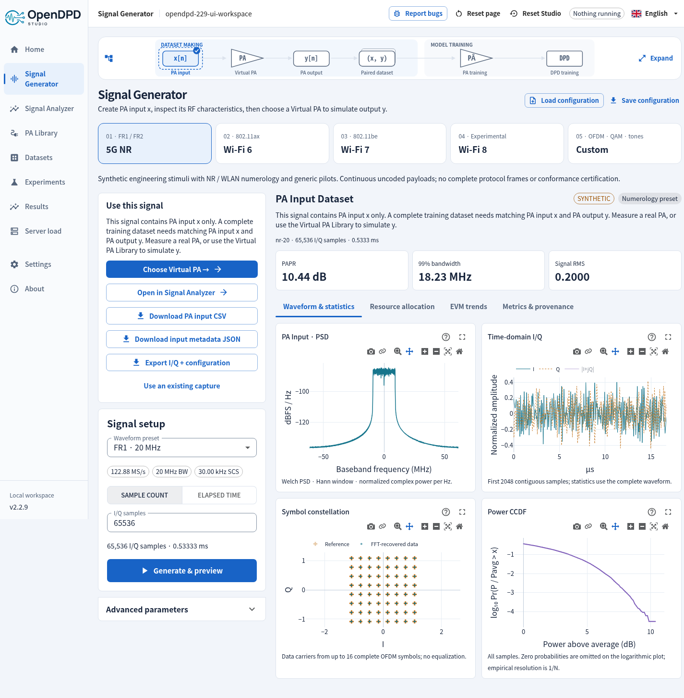

<!-- --8<-- [start:hero] -->
> **[Try OpenDPD Studio in your browser →](https://opendpd.com/studio/)**
>
> No installation. Explore example data or upload your own CSV, train PA/DPD models on shared CUDA compute, and download your checkpoints. During the trial, 2 hours without user activity clears that IP’s temporary workspaces; all data is deleted within 12 hours.

[](https://opendpd.com/studio/)
<!-- --8<-- [end:hero] -->

# OpenDPD

<!-- --8<-- [start:brand] -->
<p>
  <a href="https://opendpd.com/studio/"><picture class="brand-logo"><source
    media="(prefers-color-scheme: dark)" srcset="frontend/src/assets/opendpd-studio-logo-inverse.svg" /></picture></a>
  &nbsp;
  <a href="https://www.tudemi.com/"><picture class="brand-logo"><source
    media="(prefers-color-scheme: dark)" srcset="frontend/src/assets/emi-logo-inverse.svg" /></picture></a>
</p>
<!-- --8<-- [end:brand] -->

<!-- --8<-- [start:intro] -->
**Model a power amplifier. Train a digital predistorter. Understand the result.**

OpenDPD is a PyTorch framework for power amplifier (PA) modeling and digital predistortion (DPD), developed by the [Efficient Machine Intelligence Lab](https://www.tudemi.com/) at TU Delft. Use **OpenDPD Studio** in the browser or locally for a guided workflow, or automate experiments with the CLI and Python API. All three use the original OpenDPD training core.
<!-- --8<-- [end:intro] -->

<!-- --8<-- [start:badges] -->
[](https://github.com/lab-emi/OpenDPD/actions/workflows/ci.yml)
[](https://pypi.org/project/opendpd/)
[](https://github.com/lab-emi/OpenDPD/blob/main/LICENSE)
<!-- --8<-- [end:badges] -->

**[Documentation](https://lab-emi.github.io/OpenDPD/)** · [Studio walkthrough](docs/tutorials/gui-quickstart.md) · [Examples & Colab](examples/README.md) · [Papers & citation](docs/community/citation.md)

## What's new

<!-- --8<-- [start:studio-features] -->
**OpenDPD 2.2.11** makes signal generation easier: 1,186 compact matrix presets, multi-preset datasets, optional ideal input filtering, automatic Virtual PA dataset creation, and CSV/ZIP downloads with a standalone PA replay script. Signal Analyzer accepts real or complex CSV signals.

**Signal Generator → PA Library → PA training → DPD training/testing.** Generate a PA input, simulate its output with one of nine Virtual PAs, or use existing input/output data. Standard presets are uncoded engineering stimuli; each capture keeps its own sample rate and length.

[2.2.11 release notes](https://lab-emi.github.io/OpenDPD/releases/release-notes-2.2.11/) · [Signal Generator](https://lab-emi.github.io/OpenDPD/guides/signal-generator/) · [Signal Analyzer](https://lab-emi.github.io/OpenDPD/guides/signal-analyzer/). During the hosted trial, **2 hours of inactivity clears that IP’s temporary workspaces**; the top bar shows the expiry time.
<!-- --8<-- [end:studio-features] -->

[Feature history](docs/whats-new.md) · [Verified platform status](docs/releases/support-matrix.md)

## Get started with Studio

Use **[Studio on the web](https://opendpd.com/studio/)**, or install locally:

**1. Install [uv](https://docs.astral.sh/uv/getting-started/installation/)** (then open a new terminal).

macOS / Linux:

```sh
curl -LsSf https://astral.sh/uv/install.sh | sh
```

Windows PowerShell:

```powershell
powershell -ExecutionPolicy ByPass -c "irm https://astral.sh/uv/install.ps1 | iex"
```

**2. Create an environment, install, and launch** (same commands on all three platforms):

```sh
mkdir opendpd-lab
cd opendpd-lab
uv venv --python 3.12
uv pip install --python .venv "opendpd==2.2.11" --torch-backend=auto
uv run --no-project --python .venv opendpd gui
```

PyTorch, Studio and pywebview install together; no Node.js is needed. uv selects a PyTorch backend for the detected platform/drivers. Studio prefers available CUDA or Apple MPS, then CPU. Keep the terminal running. **A `127.0.0.1` link opens on the computer running OpenDPD**; for SSH, use the [port-forwarding instructions](docs/install.md#ssh-or-another-computer).

Click **Get Started → Signal Generator**, or **Use an existing dataset**. See [Installation](docs/install.md) for drivers, Linux system libraries, native-window troubleshooting and pip; [Studio walkthrough](docs/tutorials/gui-quickstart.md) for your first experiment.

<details>
<summary>Develop from source (Git and Node.js 22.22+ required)</summary>

<!-- --8<-- [start:source-install] -->
```sh
git clone https://github.com/lab-emi/OpenDPD.git
cd OpenDPD
uv venv --python 3.12
uv pip install --python .venv -e ".[dev]" --torch-backend=auto
npm --prefix frontend ci
npm --prefix frontend run build
uv run --no-project --python .venv opendpd gui
```
<!-- --8<-- [end:source-install] -->

</details>

## The PA → DPD workflow

| Step | What you do | What you learn |
| --- | --- | --- |
| 1. Make or select data | Generate x → configure a Virtual PA → simulate y → create a paired dataset; or open existing x/y data. | Input/output provenance, signal quality and data splits. |
| 2. Model the PA | Train a behavioral model, then test it on held-out data. | How closely it predicts the dataset response, measured or explicitly synthetic. |
| 3. Train DPD | Place a predistorter before the trained PA model. | Whether the simulated cascade becomes more linear. |
| 4. Test & export | Compare results and export the predistorted I/Q signal. | A PA input signal ready for a separate measurement experiment. |

**A DPD result evaluated through a PA model is a simulation.** Exported `u = DPD(x)` is the PA input; a physical PA measurement is needed to establish measured linearization performance. See the [Studio walkthrough](docs/tutorials/gui-quickstart.md) and [measured DPD guide](docs/tutorials/measured-dpd.md).

[PA Library guide](docs/guides/virtual-pa-library.md) · [Reading signal-chain PSD plots](docs/guides/signal-chain-spectra.md)



## Choose your next step

| I want to… | Read |
| --- | --- |
| Run the same workspace experiments from a terminal | [Headless CLI](docs/tutorials/headless-cli.md) |
| Train from Python or try a notebook | [Examples](examples/README.md) · [API reference](docs/api.md) |
| Understand the original training pipeline and quantization | [Training guide](docs/training.md) |
| Use my own I/Q measurements through Python or the CLI | [Dataset formats](datasets/README.md) · [Import & preprocessing](docs/tutorials/headless-cli.md#use-your-own-data) |
| Configure plots, animations and dashboards | [Visualization guide](docs/visualization.md) |
| Compare models or reproduce a paper | [Benchmark](benchmark/benchmark_report.md) · [Reproduction guide](docs/reproducing.md) |
| Evaluate waveforms, streaming or hardware export | [Advanced guides](docs/advanced.md) |
| Resolve installation or signal-metric questions | [FAQ](docs/faq.md) |

## Contribute & cite

Contributions of models, tests and documentation are welcome. Start with [CONTRIBUTING.md](CONTRIBUTING.md); see [testing](docs/testing.md) and [how we maintain the docs](docs/documentation.md).

If you use OpenDPD in research, cite the [OpenDPD paper](https://doi.org/10.1109/ISCAS58744.2024.10558162). [BibTeX and related papers](docs/community/citation.md) · [CITATION.cff](CITATION.cff)

**Chang Gao — Project Leader · Yizhuo Wu — Leading Developer.** [Meet the team](docs/about.md) · [EMI Lab](https://www.tudemi.com/)
