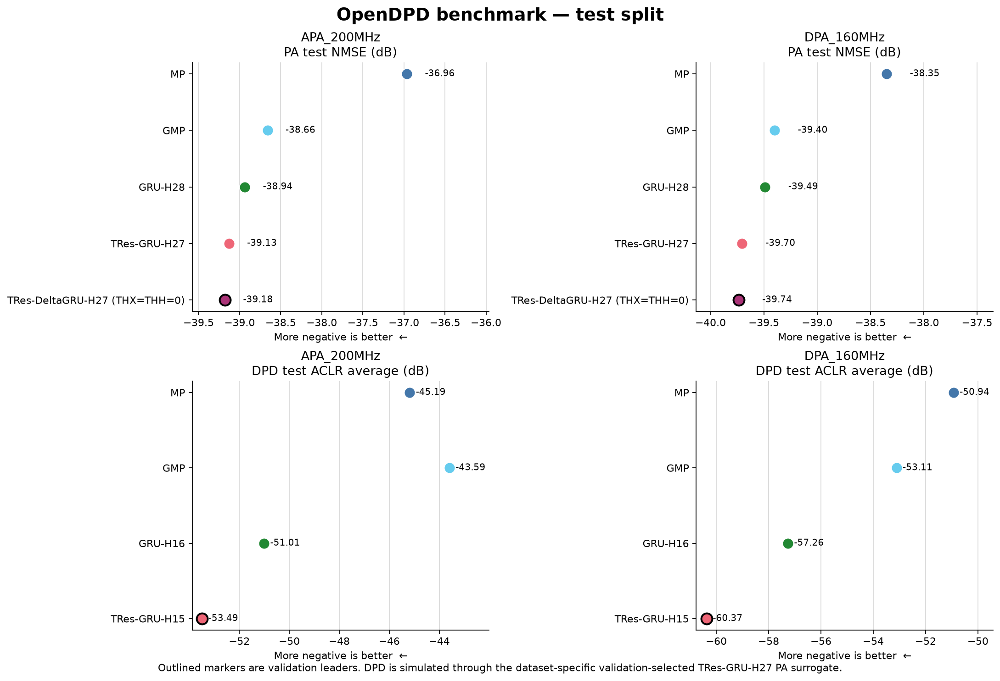
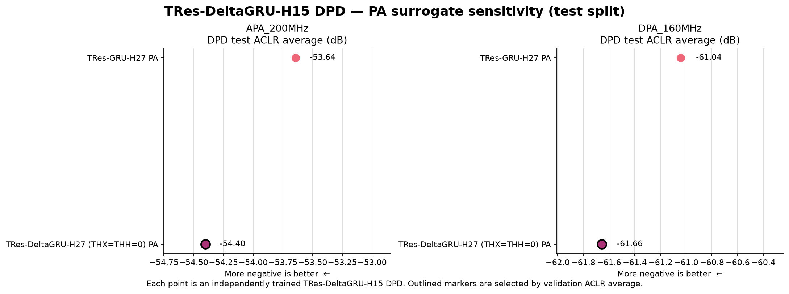

# OpenDPD PA Modeling and DPD Benchmark

## Technical summary

This benchmark evaluates MP, GMP, GRU, TRes-GRU, and TRes-DeltaGRU (THX=THH=0) for PA modeling on APA_200MHz and DPA_160MHz. The DPD comparison evaluates MP, GMP, GRU, and TRes-GRU. PA models use approximately 2,700 real parameters; DPD models use approximately 1,000. Every neural run uses the same 300-epoch optimization recipe. MP PA uses direct least squares and GMP PA uses rank-controlled truncated SVD; their predistorters use the indirect learning architecture (ILA). The four-model DPD comparison uses the dataset-specific TRes-GRU-H27 PA checkpoint selected by validation NMSE. A separate sensitivity experiment trains TRes-DeltaGRU-H15 DPD independently through both the TRes-GRU-H27 and zero-threshold TRes-DeltaGRU-H27 PA surrogates.

## Key findings

- **APA_200MHz:** the validation PA leader is TRes-DeltaGRU-H27 (THX=THH=0) at -39.0929 dB NMSE (-39.1777 dB test). The validation DPD leader is TRes-GRU-H15 at -53.4736 dB ACLR average (-53.4879 dB test). For TRes-DeltaGRU-H15 DPD, the better validation result uses the TRes-DeltaGRU-H27 (THX=THH=0) PA surrogate at -54.4874 dB ACLR average (-54.4010 dB test).
- **DPA_160MHz:** the validation PA leader is TRes-DeltaGRU-H27 (THX=THH=0) at -39.4802 dB NMSE (-39.7353 dB test). The validation DPD leader is TRes-GRU-H15 at -60.7425 dB ACLR average (-60.3717 dB test). For TRes-DeltaGRU-H15 DPD, the better validation result uses the TRes-DeltaGRU-H27 (THX=THH=0) PA surrogate at -61.9253 dB ACLR average (-61.6586 dB test).
- **APA GMP stability:** column-normalized truncated SVD at `rcond=1e-04` retains 650/1,350 singular directions. Validation/test NMSE is -38.70/-38.66 dB. The fixed cutoff suppresses ill-conditioned delayed-envelope directions instead of applying CUDA `gels`'s invalid full-rank assumption.

*Test split; more negative is better. Outlined points are the models selected by validation. DPD is simulated through the dataset-specific TRes-GRU-H27 PA surrogate.*

*Test split; each point is an independently trained TRes-DeltaGRU-H15 DPD using the named frozen PA surrogate. These results compare surrogate sensitivity, not measurements from one shared physical PA.*

## APA_200MHz

### PA modeling

| Model | Parameters | Method | Selected epoch | NMSE, val / test (dB) | EVM, val / test (dB) | Validation ACLR L / R / avg (dB) | Test ACLR L / R / avg (dB) |
|---|---:|---|---:|---:|---:|---:|---:|
| MP | 2,700 | Direct least squares | N/A | -37.0405 / -36.9635 | -40.2302 / -39.9571 | -27.4060 / -27.3703 / -27.3881 | -27.8869 / -27.7765 / -27.8317 |
| GMP | 2,700 | Truncated SVD (rank 650/1,350) | N/A | -38.7020 / -38.6606 | -43.0540 / -42.7971 | -27.4053 / -27.4129 / -27.4091 | -27.7830 / -27.6294 / -27.7062 |
| GRU-H28 | 2,746 | Supervised, AdamW | 292 | -38.8504 / -38.9367 | -43.6317 / -43.5732 | -27.3455 / -27.4211 / -27.3833 | -27.6783 / -27.6725 / -27.6754 |
| TRes-GRU-H27 | 2,751 | Supervised, AdamW | 288 | -39.0447 / -39.1293 | -43.9118 / -43.9299 | -27.4100 / -27.4074 / -27.4087 | -27.7503 / -27.6404 / -27.6953 |
| TRes-DeltaGRU-H27 (THX=THH=0) | 2,751 | Supervised, AdamW | 294 | -39.0929 / -39.1777 | -44.0254 / -43.9683 | -27.3872 / -27.4456 / -27.4164 | -27.6800 / -27.6721 / -27.6761 |

### DPD

| Model | Parameters | Method | Selected epoch | NMSE, val / test (dB) | EVM, val / test (dB) | Validation ACLR L / R / avg (dB) | Test ACLR L / R / avg (dB) |
|---|---:|---|---:|---:|---:|---:|---:|
| MP | 1,000 | ILA, least squares | N/A | -42.1149 / -42.1896 | -48.1895 / -48.1535 | -45.5590 / -44.2857 / -44.9224 | -46.0740 / -44.2980 / -45.1860 |
| GMP | 1,000 | ILA, least squares | N/A | -38.3167 / -38.5259 | -46.2753 / -46.3523 | -43.5560 / -42.3895 / -42.9727 | -44.0657 / -43.1207 / -43.5932 |
| GRU-H16 | 994 | DLA, AdamW | 299 | -45.1735 / -45.1315 | -47.6885 / -47.4275 | -51.3857 / -51.2623 / -51.3240 | -51.0559 / -50.9669 / -51.0114 |
| TRes-GRU-H15 | 999 | DLA, AdamW | 296 | -44.0368 / -44.2859 | -44.8654 / -45.0973 | -53.2065 / -53.7407 / -53.4736 | -53.4693 / -53.5066 / -53.4879 |

### TRes-DeltaGRU DPD by PA surrogate

Both rows use TRes-DeltaGRU-H15 with 999 parameters and THX=THH=0. They are separately trained through the indicated frozen PA surrogate.

| PA surrogate | PA NMSE, val / test (dB) | DPD parameters | Selected epoch | DPD NMSE, val / test (dB) | DPD EVM, val / test (dB) | DPD ACLR avg, val / test (dB) |
|---|---:|---:|---:|---:|---:|---:|
| TRes-GRU-H27 | -39.0447 / -39.1293 | 999 | 264 | -46.8471 / -46.9184 | -48.3486 / -48.2629 | -53.2898 / -53.6435 |
| TRes-DeltaGRU-H27 (THX=THH=0) | -39.0929 / -39.1777 | 999 | 296 | -47.8582 / -47.9703 | -49.8200 / -49.6999 | -54.4874 / -54.4010 |

## DPA_160MHz

### PA modeling

| Model | Parameters | Method | Selected epoch | NMSE, val / test (dB) | EVM, val / test (dB) | Validation ACLR L / R / avg (dB) | Test ACLR L / R / avg (dB) |
|---|---:|---|---:|---:|---:|---:|---:|
| MP | 2,700 | Direct least squares | N/A | -37.9823 / -38.3506 | -40.3940 / -40.9035 | -34.9319 / -34.4718 / -34.7018 | -35.1443 / -34.6409 / -34.8926 |
| GMP | 2,700 | Truncated SVD (rank 918/1,350) | N/A | -38.9088 / -39.4014 | -41.6537 / -42.3839 | -34.9108 / -34.3514 / -34.6311 | -35.0859 / -34.5171 / -34.8015 |
| GRU-H28 | 2,746 | Supervised, AdamW | 34 | -39.0801 / -39.4908 | -42.1993 / -42.8282 | -34.9599 / -34.5649 / -34.7624 | -35.0367 / -34.6393 / -34.8380 |
| TRes-GRU-H27 | 2,751 | Supervised, AdamW | 25 | -39.3229 / -39.7044 | -42.5812 / -43.1447 | -34.9905 / -34.4694 / -34.7299 | -35.1550 / -34.6605 / -34.9078 |
| TRes-DeltaGRU-H27 (THX=THH=0) | 2,751 | Supervised, AdamW | 16 | -39.4802 / -39.7353 | -42.9642 / -43.3196 | -34.9649 / -34.4466 / -34.7057 | -35.1432 / -34.6450 / -34.8941 |

### DPD

| Model | Parameters | Method | Selected epoch | NMSE, val / test (dB) | EVM, val / test (dB) | Validation ACLR L / R / avg (dB) | Test ACLR L / R / avg (dB) |
|---|---:|---|---:|---:|---:|---:|---:|
| MP | 1,000 | ILA, least squares | N/A | -43.5581 / -43.1938 | -50.4204 / -50.5002 | -49.0670 / -52.1969 / -50.6320 | -49.4442 / -52.4261 / -50.9351 |
| GMP | 1,000 | ILA, least squares | N/A | -44.2662 / -43.9721 | -50.1286 / -50.1887 | -52.3572 / -53.2123 / -52.7847 | -52.6167 / -53.6083 / -53.1125 |
| GRU-H16 | 994 | DLA, AdamW | 297 | -49.9059 / -49.7602 | -53.7314 / -53.9790 | -57.6084 / -57.0975 / -57.3530 | -57.6760 / -56.8525 / -57.2642 |
| TRes-GRU-H15 | 999 | DLA, AdamW | 296 | -52.9106 / -53.1938 | -57.1425 / -57.8451 | -60.4579 / -61.0271 / -60.7425 | -60.2712 / -60.4722 / -60.3717 |

### TRes-DeltaGRU DPD by PA surrogate

Both rows use TRes-DeltaGRU-H15 with 999 parameters and THX=THH=0. They are separately trained through the indicated frozen PA surrogate.

| PA surrogate | PA NMSE, val / test (dB) | DPD parameters | Selected epoch | DPD NMSE, val / test (dB) | DPD EVM, val / test (dB) | DPD ACLR avg, val / test (dB) |
|---|---:|---:|---:|---:|---:|---:|
| TRes-GRU-H27 | -39.3229 / -39.7044 | 999 | 295 | -53.8684 / -54.2446 | -57.9312 / -58.8486 | -61.5425 / -61.0442 |
| TRes-DeltaGRU-H27 (THX=THH=0) | -39.4802 / -39.7353 | 999 | 293 | -54.1159 / -54.3722 | -58.2478 / -59.3978 | -61.9253 / -61.6586 |

## Definitions

- **NMSE:** normalized mean-square error in dB; more negative is better. The implementation averages per-segment dB ratios rather than pooling all samples into one ratio.
- **EVM:** the repository-specific mean absolute complex-spectrum error within the configured main channel, normalized within each subchannel by reference-spectrum magnitude and converted with `20 log10`. It is not demodulated constellation EVM; more negative is better.
- **ACLR L / R / avg:** adjacent-subchannel power normalized by the strongest configured main-channel subchannel, plus the arithmetic mean of left and right, in dB. More negative is better.
- **Parameters:** neural checkpoint tensor elements. MP/GMP count two real degrees of freedom for every complex coefficient.
- **Selected epoch:** zero-based neural checkpoint epoch. It is N/A for closed-form least-squares fits.

## Model configurations

| Stage | MP | GMP | GRU | TRes-GRU | TRes-DeltaGRU |
|---|---|---|---|---|---|
| PA modeling | K=9, Q=150 | Ka/La=5/30; Kb/Lb/Mb=4/30/5; Kc/Lc/Mc=4/30/5 | H28 | H27 | H27, THX=THH=0 |
| DPD | K=5, Q=100 | Ka/La=5/20; Kb/Lb/Mb=4/20/3; Kc/Lc/Mc=4/20/2 | H16 | H15 | H15, THX=THH=0 (PA-surrogate sensitivity) |

## Temporal context and sequence boundaries

In sequence interiors, PA GMP uses up to five future samples and DPD GMP uses up to two through their leading-envelope terms. TRes-GRU and TRes-DeltaGRU use one-sample right context in their recurrent features and 16-sample right context in their dilated residual convolution. MP and GRU use no explicit future samples.

These are offline segmented evaluations. GMP delay accesses are zero-filled and reset at each `nperseg` boundary. In both TRes models, `torch.roll(..., shifts=-1)` wraps the final position to the first sample of the same supplied sequence; the convolution zero-pads both boundaries, and recurrent state resets for each sequence. Neural optimization uses overlapping 200-sample frames with stride 1, while validation and test use independent `nperseg` segments.

## Methodology

Neural PA and DPD models use batch size 64, 300 epochs, AdamW with MSE loss, initial learning rate 5e-3, and ReduceLROnPlateau with factor 0.5, patience 5, and minimum learning rate 5e-5. Frame length is 200, frame stride is 1, and seed is 0. PA checkpoints are selected by minimum validation NMSE; neural DPD checkpoints are selected by minimum validation ACLR average.

The TRes-DeltaGRU PA and DPD runs use input-delta threshold THX=0 and hidden-state-delta threshold THH=0. This disables threshold-induced temporal pruning; exact arithmetic deltas may still naturally be zero. The configuration therefore evaluates the dense zero-threshold recurrence, not a sparsity or efficiency claim.

AdamW uses weight decay 0.01, betas (0.9, 0.999), and epsilon 1e-8. The scheduler uses relative threshold 1e-4, cooldown 0, and epsilon 1e-8.

MP and GMP are complex polynomial models fit after L2 column scaling. MP and both ILA-DPD fits use `torch.linalg.lstsq` (`gels`). GMP PA modeling uses `torch.linalg.svd` (`gesvdj`) with a fixed relative cutoff of 1e-04; the effective retained rank is reported with each GMP PA result. These closed-form fits do not use the neural batch, epoch, optimizer, or learning-rate settings. PA polynomial fits map measured PA input to output directly. DPD polynomial fits use ILA, fitting a postdistorter and copying its coefficients to the predistorter. No ridge penalty or validation-tuned regularization is applied.

Each dataset uses its independently trained TRes-GRU-H27 PA surrogate for the four-model DPD comparison. The two TRes-DeltaGRU-H15 sensitivity rows are separate DPD training runs, one through that TRes-GRU PA and one through the independently trained TRes-DeltaGRU-H27 PA. Training data supply all gradient and least-squares fits. Neural validation metrics drive the learning-rate schedule and checkpoint selection; test data are not used for fitting, scheduling, or selection.

## Limitations and robustness

- Neural execution uses soft reproducibility with cuDNN benchmark enabled, so repeated runs can differ slightly.
- DPD scores measure simulated performance through a learned PA surrogate, not a fresh over-the-air or bench measurement.
- One seed is evaluated. The reported table is not a distribution over training runs.
- The five PA candidates and four primary DPD candidates are matched approximately by real parameter count, not by FLOPs, latency, memory traffic, or fit time. The PA-surrogate sensitivity experiment adds two independently trained TRes-DeltaGRU DPD runs per dataset.
- Results obtained through different learned PA surrogates are simulator-sensitivity evidence; they are not a controlled ranking against one shared physical PA response.
- CUDA `gels` assumes a full-rank design matrix and does not return numerical rank. It remains in use for MP and ILA-DPD; the GMP PA path records its SVD spectrum, cutoff, and retained rank.
- GMP PA has 1,350 stored complex coefficients (2,700 nominal real parameters), but truncated SVD reduces its effective rank. The comparison is matched by stored coefficient count, not effective degrees of freedom.
- Look-ahead is an input dependency, not measured inference latency. Streaming reformulations and continuous boundary/state handling are not evaluated.

## Provenance

- Generated: `2026-07-26T20:45:35.368238+00:00`
- Git commit: `3df35e081e6e41463fa46f21778c72a748823274`
- Git branch: `benchmark-fix`
- Git working tree at launch: `dirty`; exact source hashes and start status are retained in the machine evidence.
- Python: `3.13.14`
- PyTorch: `2.13.0+cu132`
- CUDA: `13.2`
- GPU: `NVIDIA RTX PRO 6000 Blackwell Workstation Edition`
- Canonical evidence schema: `6` (published from collector schema `6`); the source archive and completed job ledger are cryptographically bound in the machine-readable evidence.
- Reproduce the full matrix: [`reproduce_benchmark_report.sh`](reproduce_benchmark_report.sh)
- Machine-readable evidence: [`results/benchmark_report_results.json`](results/benchmark_report_results.json)
- Each reproduction run writes exact commands, a verified source snapshot, raw polynomial results, checkpoints, and CSV logs to its timestamped evidence directory.
