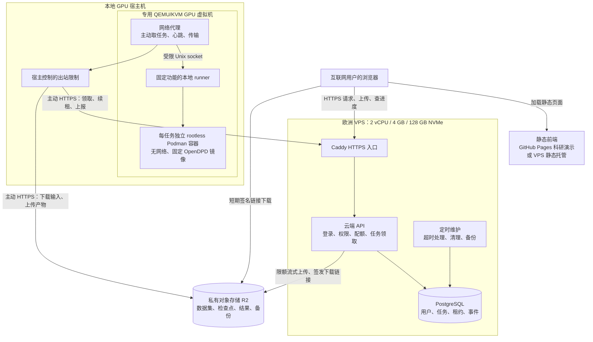

# OpenDPD 云端 API、持久队列与本地 GPU 主动取任务部署计划

日期：2026-09-12。状态：实施计划，尚未部署公网服务。适用于小规模公开科研平台；最终允许互联网用户注册使用，通过身份、配额和排队控制计算量。

公开版本使用 `<repository-root>` 和“GPU 宿主机”代替本机路径与主机标识。文中的服务名、目录、端口和资源规格作为实施参考，须在 P0 阶段复核，不是已部署公网服务的配置。

建议采用一台欧洲 VPS 运行 API、身份认证和 PostgreSQL，本地 GPU 宿主机的隔离虚拟机主动通过 HTTPS 领取任务，在无网络的 GPU 容器中执行。浏览器关闭不会取消训练；本地无需发布业务入站端口。首版按单 GPU、同一时刻一个计算任务设计。

## 1. 已有基础与必须补齐的能力

下表的软件能力已对照 Studio 基线 `6d833969` 核查。宿主机条目来自原始规划时的只读检查记录，是历史快照；本文评审没有重新连接宿主机或执行 GPU 测试，部署前必须在 P0 阶段复核。本文未启动虚拟机、切换 GPU、购买资源或开放端口。

| 项目 | 已确认的情况 | 实施影响 |
|---|---|---|
| 主仓库 | `<repository-root>`，软件基线 `6d833969`，代码版本字段为 `2.2.0.dev0` | 实施前固定候选 commit，使用独立分支；既有验证镜像与当前 Studio 代码须重新对齐 |
| Studio API | `opendpd/server/app.py` 创建本地工作区、SQLite 和进程 supervisor；`security.py` 限制 loopback、同源与本地会话 | 新增云端入口与多用户权限，保留桌面模式边界 |
| 前端 | `frontend/src/api/client.ts` 固定 `/api/v1`，使用同源 cookie | 增加本地/云端运行配置、跨 origin 会话和云端任务状态 |
| 现有任务恢复 | `opendpd/runtime/supervisor.py` 将重启遗留任务标为 interrupted | 尚不能当作持久云队列或自动续训使用 |
| 现有 checkpoint | 本次找到的 `modules/loggers.py` 保存模型 `state_dict` | 完整恢复还须保存优化器、调度器和随机状态，逐个训练流程验证 |
| 宿主账户 | `opendpd-sandbox`，固定非特权 UID，home `/var/lib/opendpd-sandbox`，nologin | 延续专用服务账户，业务代理不使用宿主管理员账户 |
| VM 实现 | systemd 直接运行 QEMU/KVM，本次未找到 virsh 命令 | 沿用现有 QEMU 管理方式，不按 libvirt 编写部署脚本 |
| GPU VM | `opendpd-gpu-validation.service`，镜像 `/var/lib/opendpd-sandbox/gpu-validation.qcow2` | 规划时记录为 inactive、disabled；原镜像保留为验证基线 |
| VM 规格与网络 | 4 vCPU、8 GiB RAM；QEMU `restrict=on`；SSH 仅映射宿主 `127.0.0.1:22223` | 目前不能直接主动访问云端；必须增加受限出站路径 |

GPU 直通和容器计算沿用此前验证基础，本次没有重新运行 GPU 测试，也没有进入已关闭的 guest 核实其当前账户、目录和包版本。实施阶段先复核这些信息。

## 2. 部署结构



箭头表示主动发起的请求；云端经既有 HTTPS 请求返回任务，不向家庭网络建立新连接。Tailscale 仅作管理员访问通道，业务任务通过前述 HTTPS 链路主动拉取。

## 3. 技术选型与代码布局

| 位置 | 选型 | 原因 |
|---|---|---|
| VPS | netcup VPS 500 G12，Amsterdam，先选灵活合约；Ubuntu 24.04 LTS | 与上一轮预算一致，初期无需云 GPU |
| HTTPS | Caddy，宿主 systemd 服务 | 统一 TLS、访问日志、请求大小和超时策略 |
| 云 API | FastAPI，独立轻量 uv 项目 | 不导入本地 Studio supervisor，不在 VPS 安装 CUDA、PyTorch 或启动训练 |
| 数据库与队列 | PostgreSQL 18 稳定补丁版，持久任务表 | 任务与配额可在同一事务中提交，减少首版独立服务数量 |
| 对象存储 | 私有 Cloudflare R2 Standard bucket | 大文件与数据库分离；输入、产物和备份分别授权 |
| 身份认证 | GitHub OAuth 授权码流程，后端交换 code，state + PKCE | 用户不向平台提交 GitHub 密码，不申请仓库写权限 |
| 本地代理 | Python、uv，systemd 自动重启 | 长轮询、日志缓冲、重连和恢复独立于网页 |
| 计算 | 既有 QEMU/KVM + rootless Podman | 网络代理与实际训练进程隔离，复用现有 GPU 直通路线 |

PostgreSQL 的 `FOR UPDATE SKIP LOCKED` 可用于多个消费者领取队列式工作；领取必须在短事务中完成，训练期间不持有数据库事务。租约、重试和任务权限由应用层实现。[PostgreSQL SELECT 文档](https://www.postgresql.org/docs/current/sql-select.html)

建议继续放在 OpenDPD 同一个仓库，路径如下；带“新增”的均为拟建目录：

```text
OpenDPD/
  frontend/                       复用页面，增加 cloud 模式
  opendpd/services/               复用科学计算服务
  opendpd/schemas/                共享实验契约
  opendpd/cloud/                  新增：独立轻量 uv 项目、API、迁移和调度
  opendpd/agent/                  新增：独立 uv 项目、取任务代理和 runner
  docs/deployment/                新增：Containerfile、systemd、网络与恢复配置
  tests/integration/              云权限、队列、故障恢复与真实计算用例
```

云端与计算端采用兼容版本的共享契约；必要时抽出无 torch 依赖的契约包。不得在 API 或前端复制指标、数据划分或训练默认值。Python 按用户偏好选标准 CPython 3.14 稳定补丁版；PyTorch 选实施时最新稳定版并核实 CUDA wheel 与驱动兼容。分别提交 `uv.lock`，镜像锁定 digest；执行任务时只用构建好的环境，不临时下载依赖。

## 4. 用户、容器与文件位置

以下除“现有”项外均为拟定命名，部署脚本应统一使用：

| 机器 | 用户或服务 | 文件与容器 |
|---|---|---|
| VPS | 管理员账户，SSH key + 私有管理网络 | 负责系统更新和发布，不参与请求处理 |
| VPS | `caddy` | `/etc/caddy/`；仅公开 80/443，80 用于跳转或证书验证 |
| VPS | `opendpd-cloud`，无 sudo | `/srv/opendpd-cloud/`；rootless `opendpd-api`、`opendpd-db`、`opendpd-maintenance` |
| VPS | API 容器内非 root 用户 | API 仅发布到宿主 `127.0.0.1:18000`，由 Caddy 转发；DB 无宿主公开端口 |
| GPU 宿主机 | 现有 `opendpd-sandbox` | `/var/lib/opendpd-sandbox/`，运行生产副本 `opendpd-gpu-worker.service` |
| GPU guest | 管理员账户 | 管理基础镜像、驱动、出站配置；不运行业务任务 |
| GPU guest | 新增 `opendpd-agent`，无 sudo | `/var/lib/opendpd-agent/`，云端受限凭据、本地上报 outbox |
| GPU guest | 复核并沿用现有非特权 `worker` | `/srv/opendpd-worker/jobs/<job_id>/<attempt_id>/`；容器名 `opendpd-job-<attempt_id>` |

代理与 runner 使用固定协议的 Unix socket，只允许领取到的任务 ID、已校验参数、启动、查询和取消；不得接受 shell 字符串、自定义镜像、任意挂载路径。计算容器只挂载当前任务输入和输出目录，不挂载代理凭据、宿主 home、其他用户任务目录或 Docker/Podman socket。

## 5. 一次任务如何运行

1. 用户登录；云 API 创建平台用户与会话。公开试运行阶段启用注册，计算量受配额控制。
2. API 先预留用户存储配额，生成上传记录。首版将浏览器上传经受限流式入口写入 R2 隔离区，边读边计实际字节，不把整个文件读入内存；超过上限立即中止并回收分片。
3. 用户提交实验配置及已完成的上传 ID。API 检查身份、数据归属、参数范围、请求幂等键和计算配额，在单个数据库事务中创建 queued 任务。
4. 本地代理空闲时发出最长约 25 秒的 HTTPS 长轮询。API 原子领取任务，返回 `job_id`、`attempt_id`、租约、固定镜像/契约版本以及本次任务的临时对象访问权限。
5. 代理下载数据到本次 attempt 目录，校验散列。离线受限容器解析并验证数据格式、样本数、数组维度和资源需求，然后调用现有 OpenDPD application services。
6. 训练写本地事件和 checkpoint；代理每 30 秒续租，按批次上传进度，避免逐 batch 请求云端。每个事件带递增序号，重发不会生成重复记录。
7. 完成后先上传结果和 manifest，再由 API 核对当前 attempt、对象元数据及权限，事务性标记 succeeded。网络故障时显示“结果待上传”，不能提前显示成功。
8. 浏览器轮询状态，登录后可再次查询历史；下载前由 API 检查归属，签发短期 GET 链接。任务终态与浏览器连接生命周期无关。

R2 签名 URL 是到期前可重复使用的访问凭证，并非一次性链接。首版仅向浏览器提供短期下载链接；后续如改为浏览器直传，必须先验证硬性大小限制、不可变输入和费用上限，不能只依赖前端声明的文件大小。[R2 签名 URL 文档](https://developers.cloudflare.com/r2/api/s3/presigned-urls/)

## 6. 排队、租约与断线恢复

云端 PostgreSQL 是任务状态的权威来源，本地目录保留尚未成功同步的事件和产物。采用“可能重试执行、结果幂等提交”的语义，不承诺物理计算恰好执行一次。

建议初始值：单 GPU 并发 1；按用户轮转、用户内部 FIFO；每用户最多 3 个未结束任务；每用户每天 2 GPU 小时、平台每天 8 GPU 小时；单任务最长 2 小时；初始上传上限 1 GiB；保留输入与结果 7 天。以上均为试运行参数，压测后调整；管理员可提高单任务时限，恢复机制仍适用于更长训练。

任务包含 `user_id`、`job_id`、`attempt_id`、`lease_expires_at`、`worker_id`、`image_digest`、配置/输入散列、最新 checkpoint manifest 与错误原因。任务状态覆盖 queued、preparing、running、uploading_results、succeeded、failed、cancelled、interrupted；worker offline 和 awaiting_reconciliation 作为连接与恢复状态单独显示。

| 故障或操作 | 规定行为 |
|---|---|
| 关闭网页、浏览器掉线 | 训练继续，重登查询原任务，不新建任务 |
| 本地网络短暂断开 | 当前任务在租约安全期限内继续；事件写本地有界 outbox，恢复后按序补传 |
| 云 API 重启 | 数据库中的队列保留；代理重连与重新核对 attempt，不重开训练 |
| 代理进程重启 | 查询 rootless 容器与 attempt 记录，接管符合身份的现存任务；不盲目再启动一个容器 |
| 无法续租持续较久 | 进入保存检查点和停止流程；停止领取新任务，不无限离线计算 |
| GPU/VM/宿主崩溃 | 标记 interrupted；支持 resume 且检查点通过校验才恢复，否则明确提示需重跑 |
| 结果上传失败 | 本地保留产物，重试上传；已完成的计算不自动重跑 |
| 取消任务 | API 记录取消请求；代理下一次心跳接收，先协作停止，再按有界时限强制结束 |
| 重复提交、心跳或完成请求 | 用户级幂等键、事件序号和 attempt 条件更新去重 |
| 旧 worker 迟到 | 租约已撤销或 attempt 已替换时，拒绝其状态与最终结果提交 |

租约初始为 5 分钟，每 30 秒续租。按最后一次确认的有效租约、扣除网络耗时并留安全余量计算本地截止时间：持续失联约 3 分钟请求 checkpoint，最迟约 4 分钟终止计算。停止监督由独立本地 runner/watchdog 执行，不能只放在可能崩溃的传输代理中。云端过期任务先进入待核对状态；首版不因一次心跳超时就立即交给另一 worker。确认原 attempt 停止后再新建 attempt；无法确认时保留 interrupted，管理员可强制撤销并接受可能存在重复计算的风险。

领取和续租都使用服务器时间；每次重新领取增加 attempt/fencing 标识。对象输出写到独立 attempt 前缀，不能覆盖另一 attempt 的产物。只有当前有效 attempt 可更新最终 manifest。这限制重复任务对结果的影响，但并不消除所有网络分区下的重复算力消耗。

## 7. 检查点恢复是独立交付项

已有最佳模型权重用于推理，不足以证明可以接着原训练过程运行。需要为公开支持的 PA 训练、DPD 训练分别记录：模型、优化器、学习率调度器、AMP scaler（若使用）、epoch/global step、CPU/CUDA/NumPy/Python RNG、采样/数据顺序、阶段依赖、配置/输入散列以及软件镜像版本。[PyTorch 检查点指南](https://docs.pytorch.org/tutorials/beginner/saving_loading_models.html)

首版在 epoch 边界原子保存临时文件后 rename，至少每个 epoch 保存一次；较长 epoch 若不能支持 step 级恢复，界面明确显示恢复粒度。在线时目标每 5 分钟同步一个已完成检查点，受安全点和上传耗时影响，不承诺任何训练都最多丢失 5 分钟。

继续训练与模型选择使用不同文件：`latest_resume` 表示恢复状态，`best_model` 保持现有科学选择规则。不得为实现 resume 改变指标、划分、种子或最佳模型选择条件。镜像或输入散列不一致、检查点损坏、训练器不支持 resume 时，返回明确原因，不静默从头运行冒充恢复。

验收对同一候选 commit 做连续训练与中断恢复训练的对照，按现有协议评估恢复位置、学习率、损失与最终指标；不放宽现有科学阈值。尚未通过验证的模型不显示“可恢复”。

## 8. 权限、数据和网络边界

- 公开 API 的每次读写、下载签名、取消和事件查询均检查 user_id 归属；知道任务 UUID 不代表有权限。配额使用事务预留，并在上传失败、取消或终态时释放/结算。
- 仅接受已发布的实验 schema、模型和资源范围；不接收用户 Python、shell、pip 包、任意 URL 或任意 PyTorch pickle 模型。首版开放内置数据集，灰度后再允许受限 CSV/数值数组上传；不提供公共远程路径导入、RF 控制和设备扫描。
- 数据解析也放到无网络的受限容器，限制行列数、展开大小、时间和内存；传输代理只处理有界元数据和字节流。读取输出时拒绝符号链接、路径越界和超量文件，日志按纯文本展示，产物不以内联 HTML 运行。
- 计算容器使用 rootless、`--network=none`、只读根目录、删除 capabilities、no-new-privileges、进程数/CPU/RAM/磁盘/时长限制，只传入所需 GPU 设备。GPU 显存不假装拥有通用硬配额；以单任务独占、参数预检查和 OOM 失败处理控制。[Podman run 文档](https://docs.podman.io/en/latest/markdown/podman-run.1.html)
- 为生产 VM 配置独立出站网络：先建立宿主控制的隔离 NAT/代理和默认拒绝策略，再允许 API 与本项目 R2 HTTPS 端点。允许名单代理需校验 CONNECT 目标、DNS 解析结果和端口，拒绝私网、宿主、家庭 LAN、Tailscale 网段、元数据地址及任意重定向目标。不能直接删除 QEMU `restrict=on` 后放任 guest 出网。
- 基础镜像构建与补丁安装走管理员维护流程；任务执行环境不开放包仓库通路。VPS root、云数据库凭据、GitHub OAuth secret 和 R2 长期凭据均不进入计算容器。
- agent 的机器凭据可独立撤销，只能领取分配给本机的任务、为其续租和申请当前 attempt 的临时对象权限；无用户管理、数据库直连、整桶列举或跨任务删除能力。
- 新建任务容器和目录，终态后按保留规则清理。VM、GPU 驱动和宿主仍需维护；固定代码加数据的工作负载是首版支持边界，任意用户代码执行需要另外设计更强隔离。

## 9. 前端域名与登录

建议使用自有域名的两个子域，例如占位域名 `app.example.org` 和 `api.example.org`。前端可由 GitHub Pages 提供文件，仍使用自定义域名；这样与 API 同 site，降低跨站 cookie 的兼容问题。

OAuth callback 在 API 域名的固定路径处理，禁用 callback 通配符；使用一次性的随机 `state` 和 PKCE `S256`，在后端验证并交换授权码。仅申请登录所需的最小身份信息权限，不申请仓库权限，OAuth token 不进入浏览器或计算容器。[GitHub OAuth 授权文档](https://docs.github.com/en/apps/oauth-apps/building-oauth-apps/authorizing-oauth-apps)

会话使用 API host-only、Secure、HttpOnly cookie，不设置宽泛 Domain。跨 origin 请求显式携带 credentials，API CORS 只允许确切前端 origin，写请求仍校验 CSRF 与 Origin，禁止通配符。CORS 不是身份认证。初版任务进度用有界轮询，避免依赖长期浏览器连接；事件 API 使用 cursor 支持重连。

前端本地模式继续使用原同源接口；云模式使用独立 API base，切换工作区路径操作为云数据集与产物 ID。Pages 项目路径、路由刷新、静态资产路径、OAuth 跳转与错误页均列入真实浏览器验收。源码、构建产物和前端环境变量中不放 secret。

GitHub Pages 官方限制其作为商业 SaaS 的免费托管。当前计划按非商业科研演示使用；若转为商业服务，把同一前端构建产物部署到 VPS Caddy 即可，队列和本地计算协议不变，通常也无需额外 VPS。[GitHub Pages 使用限制](https://docs.github.com/en/pages/getting-started-with-github-pages/github-pages-limits)

## 10. 实施顺序与交付物

工作量是工程估算，假设一名熟悉项目的开发者、账户与域名可用，预计 8–12 个工作日，另加 48–72 小时试运行观察；checkpoint 适配可能增加时间。

| 阶段 | 主要工作 | 交付与通过条件 |
|---|---|---|
| P0：固定基线，约 0.5–1 天 | 隔离开发分支；复核 guest 用户、uv、驱动、GPU 镜像；冻结一套小型 PA→DPD→推理案例 | 候选 commit、镜像 digest、输入散列、资源和现有结果记录；明确可用 GPU 时段 |
| P1：本地验证云端协议，约 2 天 | 实现独立云 API、PostgreSQL 迁移、用户归属、配额预留、任务表、租约和幂等 | 本机容器内验证排队、重复提交、越权拒绝、API 重启；模拟 worker 仅作为协议测试证据 |
| P2：接入真实计算，约 2 天 | 生产 VM 副本、受限出站、agent/runner、数据传输与离线任务容器 | 真实 API→真实 GPU→云结果完整跑通；从外部网络确认本机没有业务入站端口 |
| P3：故障恢复，约 2–4 天 | 完整 checkpoint、代理重启接管、结果补传、租约撤销和取消 | 网页关闭、断网、API/agent/VM 重启、重复完成上报等分别通过；每个训练流程给出 resume 能力 |
| P4：VPS 与前端，约 1–2 天 | 创建 VPS、域名、OAuth 应用、私有 bucket；部署 Caddy/容器；接入 cloud 页面 | 新用户可登录、提交、排队、查结果、下载；错误信息可理解；备份可恢复 |
| P5：灰度与公开入口，48–72 小时观察 | 先本人、再少量邀请用户、最后开放注册；逐步提高配额 | 无跨用户泄漏、无重复有效提交、无积压失控；管理员暂停接单与凭据撤销生效 |

P1–P3 可先完成协议和本地集成，云资源账户准备可与这些工作同步。早期对象存储协议测试使用兼容测试端点，P4 必须补做真实 R2 的上传、签名、CORS 和异常恢复验证。普通 CI 保持 CPU-only；真实 GPU 验收绑定候选 commit，沿用仓库的科学验证规则，不修改 golden 或阈值。

公网切换前应已具备可复核的发布配置和验收记录；启用入口不应成为首次发现权限或恢复问题的步骤。

## 11. 上线验收清单

| 检查 | 必须看到的结果 |
|---|---|
| 真实端到端 | 两个用户提交真实小型 PA/DPD 任务并取得可校验的输出；mock 结果不算通过 |
| 用户隔离 | 用户 A 无法读、取消或下载用户 B 的任务，无法通过对象 ID 或路径绕过 |
| 排队公平与上限 | 多用户提交至少 10 个短任务，GPU 同时只运行 1 个任务；队列有界且轮转生效 |
| 浏览器断连 | 关闭网页后 GPU 继续；重新登录显示原任务和连续进度 |
| 断网与取消 | 分别验证短断网、超租约断网、离线取消；失联算力消耗有上限，恢复不出现两个有效 attempt |
| 服务重启 | API/代理/容器分别重启；不丢已提交任务、不盲目重复启动；未上传结果可补传 |
| 续训 | 支持的 PA/DPD 流程从有效检查点继续；不支持/损坏/版本不一致时明确拒绝 |
| 恶意与超量输入 | 路径穿越、符号链接、非法参数、超大文件、解析超时、显存不足均受控失败 |
| 网络隔离 | 计算容器不能联网；guest 不能访问宿主私网、家庭 LAN、tailnet 和元数据地址；代理仅访问批准端点 |
| 恢复演练 | 从加密异地备份恢复数据库到干净实例，并与对象 manifest 核对；恢复后先冻结领取与作废旧租约 |
| 运维开关 | 暂停新任务、drain 当前任务、撤销机器凭据、回滚 API 镜像均有实际记录 |

## 12. 运维、费用与可用性边界

监控 API 可用性、数据库空间、队列等待时间、worker 最后心跳、GPU 错误/温度、任务失败率、存储用量和配额消耗。日志按 job/attempt 关联，去除 token、签名 URL 查询参数和原始用户数据，设置轮转和保留期。

数据库初期每小时做一致性逻辑备份，异地加密存储；部署配置随代码记录，密钥通过独立受限方式恢复。目标数据库 RPO ≤1 小时、人工介入后 RTO ≤4 小时，必须经恢复演练后才对外承诺。100 GB 预算按用户数据、结果、检查点及备份的总平均存量估计，不包含定期上传整张 VM 磁盘。

发布固定版本镜像，数据库迁移采用可兼容的分步变更；升级 GPU worker 前先停止领取、完成或保存当前任务，再更新。回退镜像不等于自动回退数据库；若迁移不可逆，按已验证的备份恢复方案执行。

沿用上一轮小规模预算：VPS 约 €94/年，域名 €15–20/年，对象存储与备份 €20–40/年，合计约 €130–160/年，不含人工、本地电费或高可用副本。价格与实际存量在采购时复核，费用随上传量、保留期和使用配额增长。[netcup 套餐](https://www.netcup.com/en/server/vps/vps-500-g12-iv-12m)、[R2 定价](https://developers.cloudflare.com/r2/pricing/)

单 VPS 与单台本地 GPU 都是单点。云端可全天接收有界队列，不代表本地 GPU 全天可用。GPU 宿主机的 GPU 直通会占用该 GPU；公开使用前必须明确专用服务时段或长期进入服务模式，页面展示在线/离线与排队情况。先验收来电重启、网络重连、磁盘空间与稳定负载，再把当前验证 VM 改为生产常驻服务。

正式实施时需要落实：VPS 账户与计费、域名/DNS、OAuth 应用归属、R2 账户、GPU 可用时间、试运行配额。这些都是部署输入；本计划不把尚未创建的资源或尚未通过的测试视为已完成。
