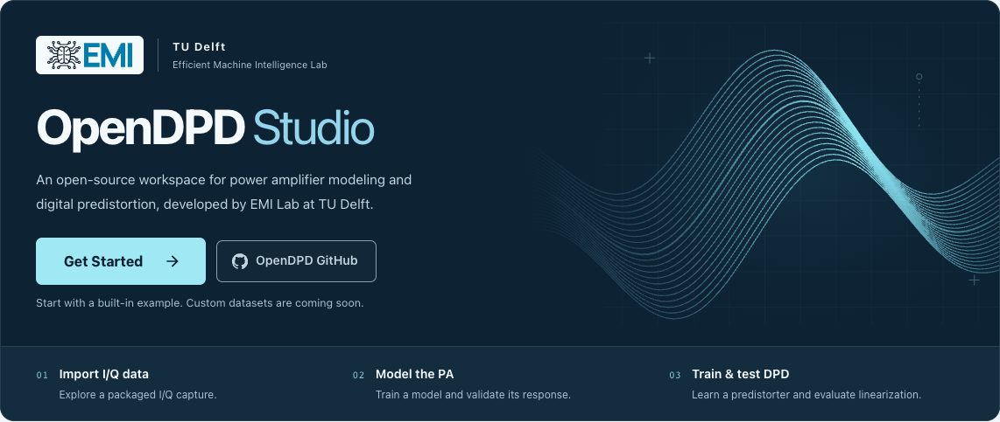

# Home repository shortcut — 2026-09-12

Added an outlined GitHub button beside Get Started, linking to https://github.com/lab-emi/OpenDPD (matches the Git origin and About page). The repository opens in a separate tab with `noopener noreferrer`. The filled Get Started action retains priority; the two buttons stack on narrow screens. Only the homepage presentation changes, with no new dependencies or scientific code.

Validation on macOS 26.6.2: `npm --prefix frontend run build`, `npm --prefix frontend run lint`, and `git diff --check` passed. The existing `Onboarding.test.tsx` suite passed all three tests. The existing Plotly bundle-size warning remains.

Playwright against the real running local API verified the button at widths 320, 390, 640, 960, 1366 and 1920 CSS pixels; the page and button stayed within each viewport. Clicking the actual link opened https://github.com/lab-emi/OpenDPD in a new tab. Desktop and narrow screenshots were visually inspected; the retained image contains only the homepage hero.

No new training run was needed for this navigation-only change. The existing Studio process and user progress were retained; its static assets were rebuilt. Temporary browser sessions, credentials and excess screenshots were removed.
