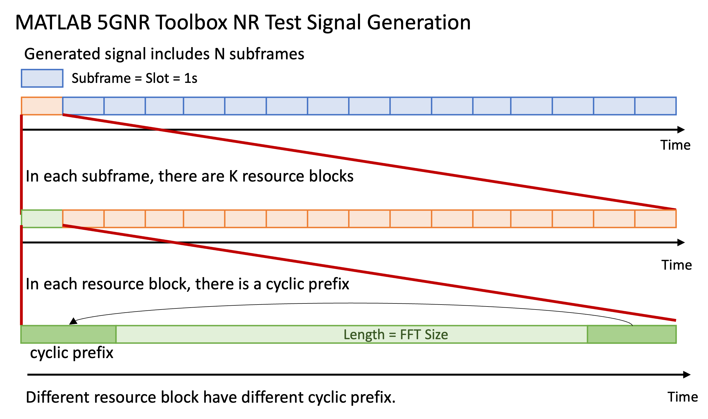

# FAQ

## Why did pip install not give me Studio?

The PyPI 2.1.0 release provides the original core API and `opendpd-cli`. Studio is in the 2.2 development preview and currently requires a [source installation](install.md), including a frontend build. Installing an extra named `gui` or `desktop` from the older release does not add that code.

## Which command should I use?

- **`opendpd gui`** opens Studio.
- **`opendpd run`** executes workspace experiments using the same service as Studio.
- **`opendpd-cli`** mirrors the original **`python main.py`** pipeline.
- The high-level **Python API** wraps the original training and dataset functions.

Use the [workspace CLI guide](tutorials/headless-cli.md), [training guide](training.md) or [API reference](api.md) for the corresponding path.

## Can I upload my own dataset?

The current Studio preview disables dataset upload and displays **Coming soon**. You can use the local [CLI import workflow](tutorials/headless-cli.md#use-your-own-data) or [Python dataset API](api.md). Start the GUI walkthrough with a built-in dataset.

## Why is a DPD result labeled simulated?

DPD training uses a learned PA surrogate. Its output is a model prediction; the exported `u = DPD(x)` is the input to be sent to a PA. A physical capture and its provenance are needed for measured evidence. See [Measured DPD](tutorials/measured-dpd.md).

## Why do live scores differ from the final result?

A live signal preview uses a bounded probe and is labeled as such. The final test result follows the configured evaluation profile and split. Changing plot refresh, pan or zoom does not change the stored score. See [Visualization](visualization.md).

## Why do APA_200MHz metadata and paper descriptions differ?

The original paper describes a TM3.1a, 5 × 40 MHz (200 MHz) 256-QAM test signal captured at 983.04 MS/s. The legacy evaluation metadata models it as a single 200 MHz channel to avoid inappropriate channel segmentation in that metric implementation.

The legacy FFT-based metric calculation and the dataset-specific constellation demodulator serve different purposes. A constellation figure alone does not establish a standards-compliant EVM value. The original MATLAB reference `Matlab/calculate_200MHz_256QAM_evm.m` is specific to this signal.

For the current signal and demodulator details, read [Datasets](datasets.md). For score definitions, limitations and reference-bound evaluation, read [Metric profiles](protocols/metric-profiles.md) and [Waveform evaluation](tutorials/waveform-evaluation.md). These guides document the conventions; they do not change the frozen legacy metric.
