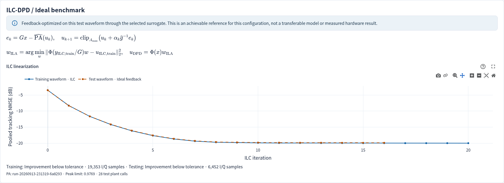

# ILC and ILA DPD

Studio 2.2.5 exposes **ILC linearization** beside PA Training/Testing and **ILC-DPD / Ideal benchmark** beside DPD Training/Testing. First train a usable forward PA surrogate on the paired dataset. ILC is an input-waveform controller, not an alternative forward PA identifier.

## The two outputs

1. **ILC-DPD (ILA)** is a causal memory polynomial you can apply to a new input. On a bounded prefix of the training split, ILC learns an input `u` that makes the bound surrogate approach `G*x`. ILA fits `Phi(y_ILC/G) w ≈ u_ILC`, then copies the postdistorter coefficients into the predistorter. The test split never supplies fitting samples.
2. **ILC Ideal DPD** is a separate, explicitly labelled test-waveform reference. It uses repeated feedback on that same test waveform through the selected surrogate. It is not a transferable model, proof of a global optimum, hardware evidence or a fair substitute for held-out model generalization. Its score may stop short of the target when the plant saturates or the update cannot improve.

The constant target gain `G` retains the existing OpenDPD gain rule. The complex inverse learning gain is estimated from training-only input/output of the bound surrogate. Each plant replay resets model state at the same dataset segment boundaries; final-segment padding is excluded from the controller's pooled error. The update is:

```text
e[k]   = G*x - PA(u[k])
u[k+1] = clip(u[k] + alpha[k] * inverse_gain * e[k], peak_limit)
```

The surrogate replay uses the selected accelerator; polynomial fitting and coefficient arithmetic use CPU complex128 for numerical stability. MPS hardware validation remains pending. The implementation uses a constant gain inverse, not a frequency-dependent BLA inverse. Each rejected update halves the learning step; only lower-error candidates are accepted. The algorithm reports target reached, iteration limit, no improving step, or improvement below tolerance. Cancellation is checked between plant evaluations.

## Starting hyperparameters

| Setting | Default | Effect |
| --- | --- | --- |
| Iterations | 30 | Upper bound on waveform updates |
| Learning gain | 0.5 | Initial correction size; backtracking can reduce it |
| Target pooled NMSE | −45 dB | Stop threshold; no guaranteed attainability |
| Peak factor | 1.5 | Peak cap relative to the PA model's training-input peak; values above 1 permit extrapolation |
| Backtracking steps | 6 | Maximum halvings per update |
| Minimum improvement | 0.001 dB | Stop when progress becomes negligible |
| Fit samples | 32,768 | Leading training samples used by ILC and ILA |
| MP envelope order count K | 7 | Powers 0 through K−1 |
| MP memory depth Q | 5 samples | Past input context |
| SVD relative cutoff | 10⁻⁶ | Truncate poorly conditioned fitting directions |

These are conservative starting settings, not universally optimal values. Reduce the peak factor and input level when extrapolation or saturation dominates; reduce learning gain when many steps backtrack. Increase model order/depth only when independent validation supports it. The public app caps K/Q at 9/16, iterations at 60, fit samples at 32,768 and backtracking at 6.



## Inspect and reproduce

Results show the two ILC convergence curves, stopping reasons, sample counts, peak cap and PA checkpoint identity. Metric definitions render in LaTeX. Main result metrics score the fitted DPD; the Ideal reference is a separate baseline under the same calculation method. PSDs put Ideal and fitted signals into their respective PA Input and PA Output panels. No score definitions or frozen legacy protocols change.

Artifacts include `ilc.json`, training waveforms in `ilc-training.npz`, `ilc-benchmark.json`, `ilc-ideal-test.csv`, the transferable checkpoint and ordinary result/plot files. Re-evaluating a run does not rewrite its training data. Testing with another PA surrogate creates a new result and re-estimates the learning gain from training data for that surrogate.

The framework follows [Schoukens, Hammenecker & Cooman, *Obtaining the Preinverse of a Power Amplifier Using Iterative Learning Control*](https://doi.org/10.1109/TMTT.2017.2694822) ([author preprint](https://arxiv.org/abs/1606.08663)); this release uses an ILA postinverse fit after waveform learning. It does not reproduce the paper's frequency-dependent learning filter or claim its experimental performance.
