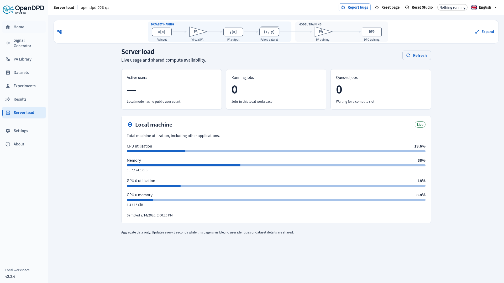
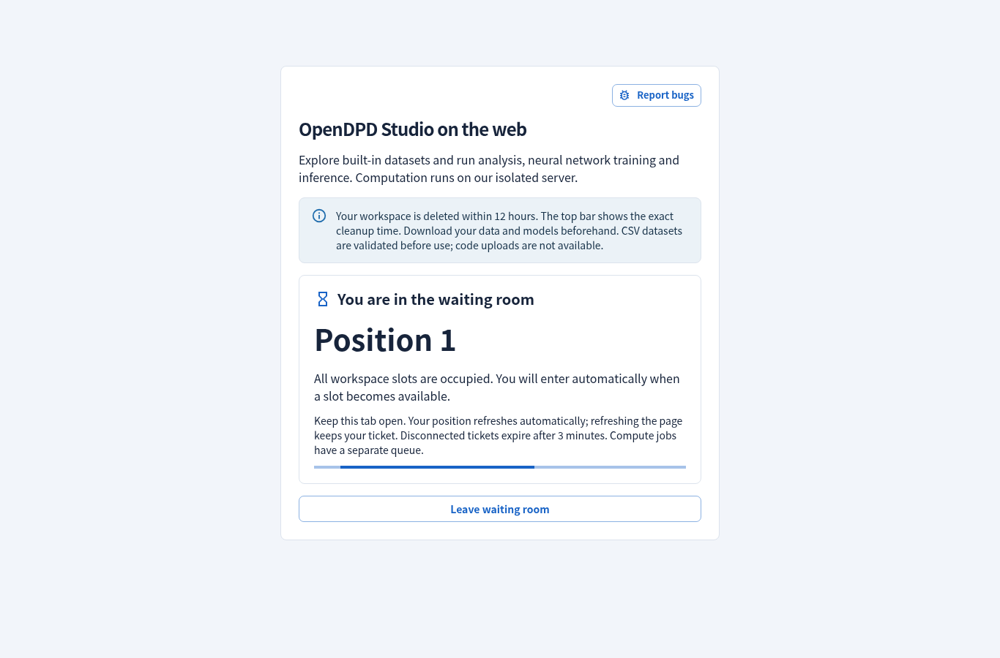

# Server load and workspace cleanup

Open **Server load** in the sidebar to see current resource usage and shared compute availability. The page refreshes every five seconds while visible and stops polling when you leave it. Use **Refresh** for an immediate reading.

| Reading | Meaning |
| --- | --- |
| Active users | An estimate: authenticated sessions with API activity in the last five minutes. One person can have multiple sessions; this is not a count of distinct people. |
| Running jobs | Experiments running or stopping across all active workspaces. |
| Queued jobs | Experiments waiting for the shared training slot. |
| Temporary workspaces | Unexpired sessions, including currently inactive ones, versus the configured capacity (256 on the hosted service). |
| Waiting visitors | Live waiting-room tickets; these do not yet own a workspace or a compute slot. |
| API server | CPU and memory inside the public service's virtual machine. |
| Compute host | Total host CPU, RAM, GPU 0 utilization and GPU memory, including workloads outside OpenDPD. |

Local Studio shows **Local machine** with its CPU, RAM and NVIDIA GPU 0 when available. It shows a dash for active users because local browser sessions are not a reliable user count. GPU utilization telemetry requires `nvidia-smi`; a dash on a CPU/MPS machine does not mean that its accelerator is disabled.

Samples older than 20 seconds show **Stale** and hide numerical utilization until collection resumes. Missing values and failed job-count collection show a dash, never a fabricated zero. After an API error the page backs off to 30 seconds. Aggregate telemetry contains no usernames, process names, IP addresses, dataset details or workspace paths.

## Cleanup timestamp

Public Studio shows one persistent cleanup timestamp in the top bar, for example **2026-09-15 04:00:00 UTC**. It is the earlier of inactivity expiry and scheduled cleanup. Its tooltip explains the rule and corresponding local time. Mobile screens place it on a separate compact top-bar row.

**During the trial, 2 hours without user activity clears all temporary workspaces created from that IP.** Using a foreground Studio tab renews that group's inactivity deadline. Background polling, an untouched open tab and running jobs do not renew it. Workspaces still have separate credentials and files, including when visitors share a university or company network. A valid session accessed from another network remains in its original creation-IP group.

Access expires and cleanup starts at the displayed time. Download your datasets, checkpoints and results beforehand. Activity cannot extend the hard cutoff at **11:55 or 23:55 UTC**. Sweeps check expiry every five seconds, stop expired jobs and wait for active requests before removing their files; independent resets at **11:59 and 23:59 UTC** stop remaining workers and clear temporary storage. New sessions resume after **12:00 or 00:00 UTC**. This keeps data within a 12-hour window; a visitor arriving shortly before cleanup gets less time. The local app uses persistent workspaces and has no inactivity or scheduled deletion.

Another workspace from the same IP may renew the shared deadline. An idle tab checks the current server deadline before signing out; network errors during this check preserve its credential for a retry. Browser activity reports are coalesced to at most one per minute, and the API's clock determines expiry.

See [hosting architecture](../architecture/public-studio.md) for the operator limits and isolation model.

## Waiting for a workspace

The screenshot uses a controlled two-slot test service to exercise the same waiting-room UI; the production limit is 256.

The hosted service supports 256 open workspaces and a bounded waiting room of 1,024 tickets. If every slot is occupied or shared storage is low, **Start a temporary session** shows your queue position and automatically retries every five seconds. Keep the tab open. Refreshing the same tab keeps the ticket; after three minutes without a successful heartbeat it expires and a later request rejoins at the back. A service restart also clears the waiting room, and connected tabs rejoin automatically. Waiting-room heartbeats do not renew existing workspaces. No exact wait time is promised because other visitors may still be active.

Waiting tickets are separate from the training queue and allocate no dataset directory or background supervisor. Once admitted, your experiments still share one compute slot and run in order. Increasing workspace capacity does not multiply GPU throughput.

On **Server load**, choose **End workspace**, then confirm after downloading anything you need. This stops your jobs, deletes your temporary data and frees a slot without waiting for the next scheduled cutoff. Closing a browser tab alone does not delete its workspace.
