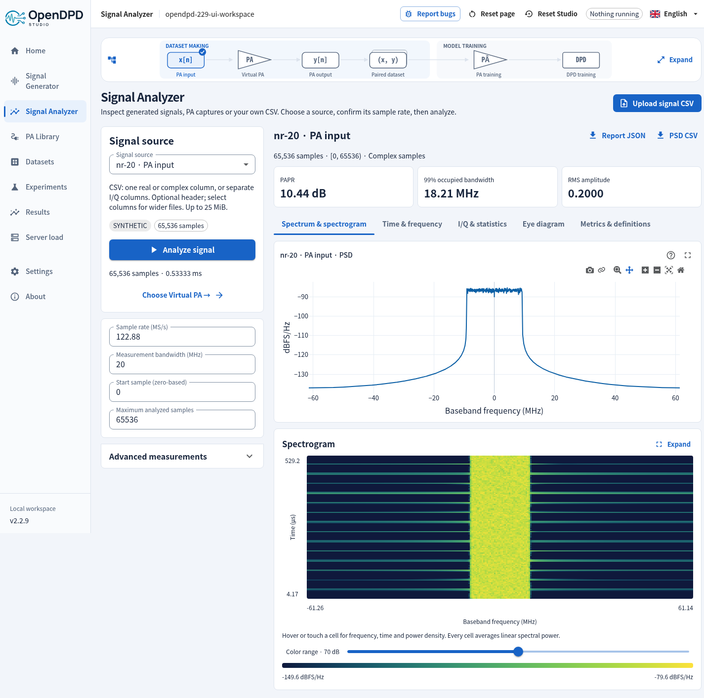

# Studio Signal Analyzer

Open **Signal Analyzer** in the sidebar, or select **Open in Signal Analyzer** from Signal Generator, PA Library or a dataset. Analysis does not create a PA response or a paired training dataset.

## Choose a source

- **Generated PA input:** reuse its exact exported samples and sample-rate metadata.
- **Virtual PA output:** inspect a simulated response and optionally choose its input as an aligned reference.
- **Dataset:** select input or output; a link from dataset inspection preserves the selected preprocessing version.
- **CSV:** upload one real column, one complex column (`0.1+0.2j` or `0.1+0.2i`), or separate real I and Q columns. An optional header is supported. For wider files, select the signal and Q columns explicitly.

CSV files must be UTF-8 and comma-separated, with 256–1,000,000 rows, at most eight columns and two million numeric fields, and at most 25 MiB. Every field must be finite and fit the supported sample range. Binary files, formulas, inconsistent row widths and malformed samples are rejected. Files are quarantined until the complete scan passes. At most 16 uploaded signals are retained per workspace.

**Confirm the sample rate.** CSV does not carry it. For known sources, changing the rate reinterprets the sample timing without resampling, and the report records the override. Select a zero-based start and maximum sample count; the page displays how many available samples will be analyzed. Nothing runs automatically when you change a control.

## Views

| View | What it shows |
| --- | --- |
| Spectrum | Independent two-sided PSD for the selected signal; configurable FFT, Hann/Hamming/Blackman/rectangular window and overlap |
| Spectrogram | Time-varying spectral power; interactive cell readings, color range and expanded view |
| Time | First 2,048 contiguous I/Q and envelope samples; adjacent-sample instantaneous frequency where the envelope is nonzero |
| I/Q and statistics | Raw sample scatter, empirical CCDF and amplitude distribution |
| Eye | Raw sample overlays at the specified samples per symbol and timing offset; up to 64 traces |
| Metrics | RMS, peak, PAPR, DC, I/Q RMS, integrated channel power, occupied bandwidth, FFT spacing, equivalent noise bandwidth and adjacent-channel ratios |

Real inputs retain both spectral images. Raw I/Q scatter is not a demodulated constellation; an OFDM capture does not form a single-carrier eye. No packet decoding or standards pass/fail is inferred.

## Measurements and references

Scalar measurements use the entire selected contiguous window, up to one million samples. Time plots and scatter are bounded independently. Spectrogram windows contain at most 1,024 samples; every linear-power cell contributes when reducing the display to at most 256 frequencies × 128 times. This is a time/frequency-resolution tradeoff, separate from the PSD FFT setting.

Power is relative to unit sample amplitude: 0 dBFS means mean squared magnitude equals one. It is not calibrated dBm. Equivalent noise bandwidth uses the actual window; occupied bandwidth integrates the requested central power fraction. Adjacent bands have the same width as the main band. An adjacent band outside Nyquist is unavailable, not truncated.

An optional reference must have the same sample rate and selected range. Errors use aligned sample-domain differences; no timing search or resampling is applied. **Fit reference gain and phase** explicitly enables a scalar least-squares fit; otherwise the scalar is one. The result is waveform RMS error/NMSE, not a standard EVM verdict. Optional DC removal and frequency shifting affect the analysis signal only, and are disclosed in the report.

Download **Report JSON** for settings, source hashes, measurements, notes and plotted values; download **PSD CSV** for the exact displayed frequency bins. Changes mark old results stale until **Analyze signal** succeeds again. Hosted data follows the existing two-hour inactivity and scheduled-cleanup rules.
