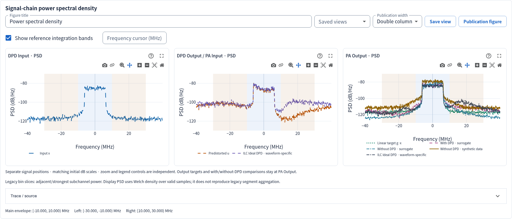

# Reading signal-chain PSD plots

Studio 2.2.4 gives each signal-chain location its own power spectral density chart.
The charts start with matching dB scales and retain independent zoom, legend and
enlarge controls. Curves at the same location remain together for comparison.

| Chart | Signal | Comparisons kept in this chart |
| --- | --- | --- |
| DPD Input | Original target x | Inputs from the selected runs |
| DPD Output / PA Input | Predistorted drive u = DPD(x) | Predistorted drives from the selected runs |
| PA Output | y = PA(u) | Linear output target g·x, with-DPD output, surrogate without DPD and measured or synthetic dataset output without DPD |

**DPD output is the signal driving the PA.** A curve called “with DPD” that was
computed through a PA surrogate belongs to PA Output, not DPD Output. The linear
target g·x is an output reference, not an additional captured input.

PA modeling and dataset inspection have only **PA Input** and **PA Output** charts.
The Signal Generator shows only PA Input. PA Library shows the generated input and
the explicitly simulated Virtual PA output separately. Missing signal locations
are not fabricated. Legacy plots without enough identity information use an
Unspecified signal position chart.

## Legends and provenance

Each chart has its own compact legend below the axes. Line color and dash distinguish
curves without covering the spectral shoulders. Single-run views omit the run ID;
multi-run views use R1, R2, … and list the full run-ID key underneath. Trace controls
and the cursor table retain the original names, source and capture identity. Synthetic
dataset outputs are labelled synthetic; mock evidence remains marked MOCK.

Switching a legend affects only that chart. Full input/output target and baseline
curves remain available in Trace controls. Saving a review preserves independent
axis ranges, selected traces, the frequency cursor, bands, reference and profiles.

## Live views and exports

Training, testing, result detail, comparison, dataset inspection, Signal Generator
and PA Library all use the same position labels. DPD validation probes capture u
at the PA-model input during the same shadow forward pass that produces PA(u).
The shadow remains in evaluation mode with RNG state preserved. Final plots use
the exact saved test arrays and valid sample count.

Publication preview, PNG/SVG/PDF exports and HTML reports separate signal positions
too. Existing mixed spectrum figure specifications are expanded into position
panels when previewed or exported; their stored PSD arrays are not rewritten.
The standalone export includes its layout helper and hash-checked replay script.

## Numerical meaning

This change reorganizes plots. It does not change the Welch estimator, sample
selection, amplitude scaling, PSD bins, metric definitions or integration bands.
The usual spectrum units are dB re amplitude²/Hz; normalized-frequency files use
cycles/sample. Generator PSD uses its documented unit-RMS dBFS reference.
None of these plots implies calibrated RF watts or dBm.

Band shading follows the selected result's metric profile. Legacy and general
spectral ACLR/ACPR retain their distinct definitions. Zooming does not recalculate
metrics. See [research review](research-review.md) for protocol compatibility,
saved provenance and frequency-cursor interpretation.

ILC runs add a waveform-specific Ideal trace to the PA Input and PA Output panels. The legend preserves that identity alongside the fitted DPD. Ideal feedback uses the current test waveform; see [ILC and ILA](ilc-dpd.md) before comparing it with a transferable model.
