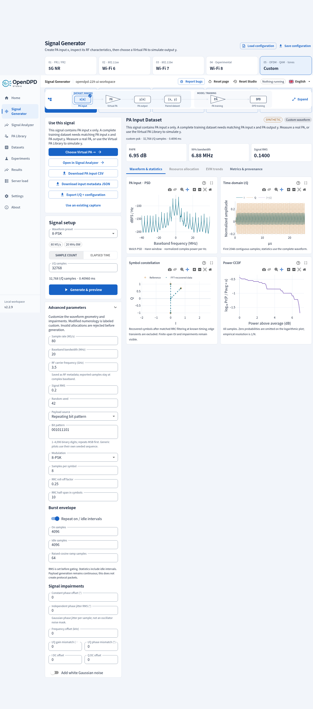
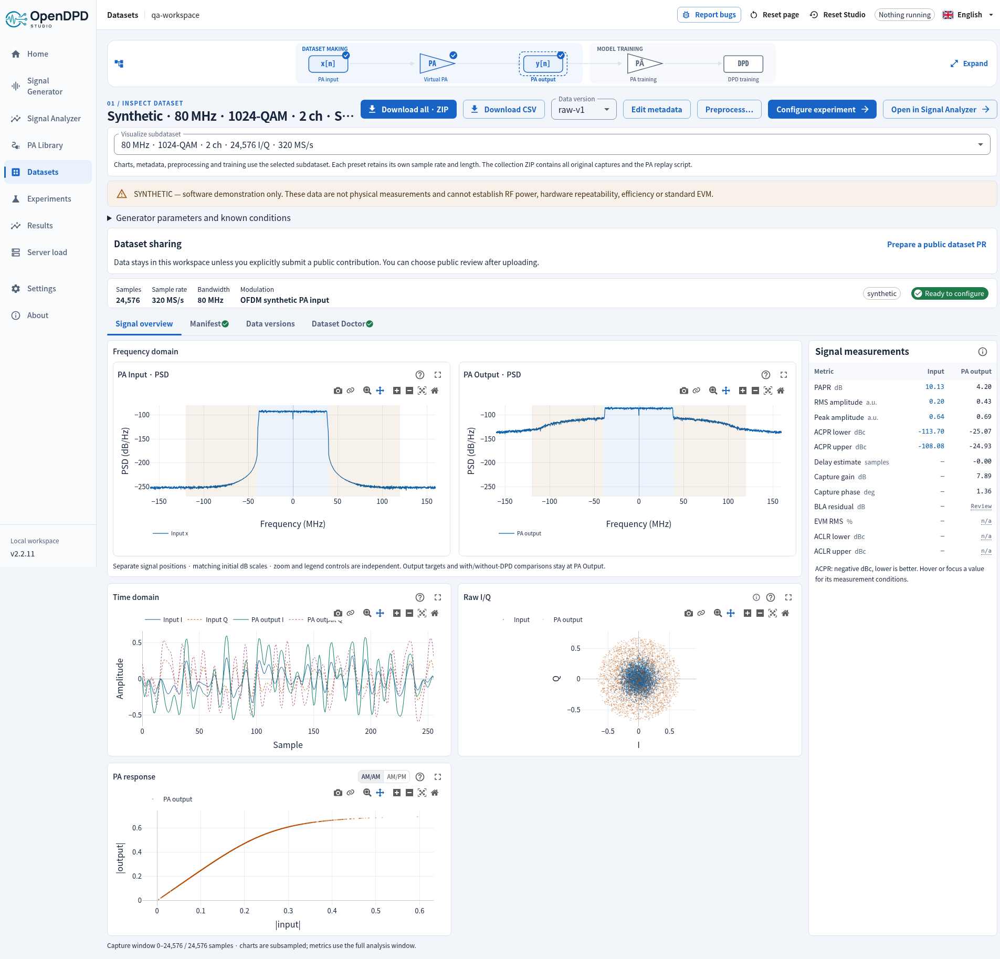

# Studio Signal Generator

Open **Signal Generator** in the sidebar, or choose **Get Started → Signal Generator**.
The sidebar expands to **Generate** and **Preview** while Signal Generator is open. Generate is the default page. The first visit selects a private NR 20 MHz configuration; generation starts only when requested. Choose **5G NR**, **Wi-Fi 6**, **Wi-Fi 7** or **Custom**. The dataset name and **Generate & preview** action sit at the top of **Signal setup**.

Select one or more compact matrix cells: bandwidth runs horizontally, QAM vertically, and each group has a different OFDMA channel count. NR numerology buttons switch FR1/FR2 and subcarrier spacing. Selected chips let you edit or preview each preset. Sample count, duration and the optional default filter apply to the highlighted preset. Press **Generate & preview** once for the whole selection.

Generation opens **Preview** automatically. **Use this Signal: [dataset name]** puts **Choose Virtual PA**, Analyzer and download actions above the plots. **Visualize a Signal in the Generated Dataset**, just before the visualizations, selects which member to inspect.

The result is explicitly a **PA Input Dataset (x)**, with no PA output. Its editable suggested name starts with `syn_pa_in_` and summarizes the waveform/specification ranges and number of signals. Virtual PA simulation produces corresponding `syn_pa_out_` and `syn_pa_inout_` output and paired dataset names. Parameter changes disable exports and the next step until regenerated. Returning to this tab restores the selected batch. Up to 16 presets can be selected, with different sample rates and lengths; they are never silently concatenated.

The onboarding dialog has exactly one highlighted action: Signal Generator. Existing
datasets are the second choice, and CSV upload is third. PA and DPD each have one
model workspace with Training and Testing tabs. Existing task URLs remain valid.
Testing displays the selected dataset version's test split count and equivalent time,
before any model warm-up or evaluation-edge exclusions.

## Waveforms and coverage

The generator provides synthetic engineering stimuli with standard numerologies,
not complete protocol implementations or certified reference test models.

| Family | Presets | Implemented signal |
| --- | --- | --- |
| 5G NR | 940 presets | FR1 3–100 MHz and FR2-1 50–400 MHz; 15/30/60/120 kHz SCS where defined; QPSK through 1024-QAM |
| Wi-Fi 6 | 96 presets | 20/40/80/160 MHz; BPSK through 1024-QAM; 1/2/4/8 allocations |
| Wi-Fi 7 | 140 presets | 20/40/80/160/320 MHz; BPSK through 4096-QAM; 1/2/4/8 allocations |
| Custom | 10 waveforms | OFDM/OFDMA, DFT-spread OFDM, QAM, PSK, FSK/GFSK, noise, tone, multitone, chirp |

See the [preset tables and source references](signal-presets.md) for exact RB/tone counts, timing and implementation limits. These uncoded payloads use generic pilots and allocation placement, with no full protocol framing or conformance certification. Wi-Fi 8 generation has been removed. Existing stored signals remain readable.

## Advanced parameters

- Output sample rate, nominal baseband bandwidth, RF carrier metadata, RMS and seed.
- Exact complex sample count, or equivalent duration rounded to the nearest sample.
  One complex sample contains I and Q. The current limit is 256–1,000,000 samples.
- FFT size, 1/2/4/8× oversampling, subcarrier spacing, fixed/NR CP and DC null.
- Up to 16 OFDMA channels with independent carrier counts, modulation and relative
  power. Counts include pilots. Channel gaps are specified in FFT bins. These are
  users within one RF band, not separate RF carriers for adjacent-channel metrics.
- Per-channel pilot comb, explicit signed carrier indices, or no pilots; pilot boost.
- RRC QAM/PSK pulse shaping, samples per symbol, roll-off and total filter span.
- Tone frequency, multitone count, and a linear chirp over the declared bandwidth.
- Frequency offset, I gain mismatch, Q phase mismatch, I/Q DC offsets, envelope
  clipping and independent white Gaussian noise.

`SCS = output sample rate / (FFT size × oversampling)`. The FFT and fixed CP inputs
refer to the grid before oversampling; measured CP lengths are reported in output
samples. Changing SCS in the GUI updates the output sample rate. Carrier frequency
is saved as RF metadata and never digitally mixes a GHz signal into the baseband.

RMS normalization precedes impairments. I gain and Q phase mismatch are applied
first, followed by DC offset, frequency offset, clipping and noise. The optional default FFT low-pass follows the impairments and preserves their resulting RMS. Its cosine transition spans the outer 4% of nominal half-bandwidth. Filtering can change EVM, peaks and burst edges; the receiver performs no fitted equalization. See [filter semantics](signal-presets.md#length-and-filtering).

## Visualizations and measurements

Time plots display the first 2,048 contiguous samples without strided sampling.
Spectrum, RMS, peak, PAPR and CCDF statistics use the entire exported waveform.
Welch PSD uses a Hann window, 50% overlap and density scaling. Power is referenced
to unit complex RMS, not calibrated watts or dBm. Occupied bandwidth contains the
central 99% of integrated Welch power, including impairments.

PAPR is the maximum sample power divided by average sample power, in dB. It does
not estimate unsampled analog peaks. CCDF is the empirical exceedance probability
of power above its mean; zero-probability points are omitted on the logarithmic
plot, with empirical resolution 1/N.

OFDM constellation and diagnostic reference EVM use data carriers from up to the
first 16 complete symbols. The FFT receiver uses the known generation normalization;
it does not fit gain, phase, delay, or equalization. A capture with no complete symbol
has no reference EVM. Single-carrier constellation uses matched RRC filtering at known symbol timing, excluding edge transients. Finite-span ISI and impairments remain visible. Incomplete final symbols are
retained to preserve the exact requested sample count and disclosed in metadata.

## Export and training

**Save configuration** downloads the highlighted preset's JSON; **Load configuration** validates and selects it. **Download PA input CSV** and **Download input metadata JSON** export the currently previewed signal separately. CSV columns are `I,Q`; metadata records the signal role, actual sample rate/count, seed, filter and waveform parameters, numeric environment and hashes. Seeded byte reproduction requires the recorded implementation and environment.

The waveform has **no PA output**. **Choose Virtual PA** carries all selected inputs to [PA Library](virtual-pa-library.md). Choose the mathematical PA and parameters, then click **Simulate PA output**. Studio simulates every capture independently, saves the complete dataset automatically and opens **Datasets → details**. There is no separate pairing form. Each capture requires at least 8,192 input samples. The default split is 60/20/20 with 256-sample guards; preprocessing can create a different version later.

DPD training additionally requires enough real samples in each evaluated split for one PSD segment. The setup check explains any shortage before starting a job. Generate a longer capture or choose an appropriate PSD segment length in the dataset metadata; padded samples do not count. On the dataset page, **Train PA & DPD Models** continues to model setup.

For multiple presets, **Visualize subdataset** switches charts, metadata, preprocessing and training to that capture's own sample rate. **Download CSV** exports the selected capture/version as `I_in,Q_in,I_out,Q_out`. **Download all · ZIP** exports every original capture, per-capture metadata and one frozen `simulate_pa.py`:

```bash
uv run simulate_pa.py 01-nr-20.csv --output pa-output.csv
# For an independently named input:
uv run simulate_pa.py my-input.csv --preset 01-nr-20.csv --output pa-output.csv
```

The script accepts `I,Q` or `I_in,Q_in`, requires NumPy/SciPy, and exposes `--sample-rate` and bounded `--parameter NAME=VALUE` overrides. It runs without an OpenDPD installation. Each CSV can have a different length. Memory state starts from zero for each capture; output is not filtered or normalized. Matching numerical libraries reproduce float32 output exactly in release tests; other platforms may differ by roundoff.

A single-preset dataset downloads directly as CSV. The deprecated separate-pairing APIs remain for older clients; the new GUI uses the one-step dataset endpoint.

Get Started → existing dataset opens a paired-data selector and proceeds straight
to PA Training. The compact, expandable workflow diagram marks dataset making as
complete and explains the bypass. Model-training checks require successful runs
for the selected dataset/version and PA reference.

Generated datasets are private by default. Optional publication uses the existing
dataset contribution workflow: an explicit reviewed package, a separate branch,
push and PR, followed by human merge review. Contact: emi.lab@outlook.com.

Hosted sessions apply authentication, tenant isolation, size limits and generation
quotas. Dataset creation respects the host's custom-dataset capability. No RF
transmitter, GitHub submission, or email is activated by generating a waveform.

## Verification

Numerical tests cover all 1,186 presets, exact sample counts, one-millisecond NR CP
timing, FFT allocations, empty bins, deterministic impairments, analytic single-tone
PAPR, invalid parameters, export round trips and dataset provenance. API tests cover
authentication, CSRF, host feature gating and per-version test counts. Hosted tests
verify that one session cannot access another session's generated signals or data.

`scripts/verify_signal_generator.mjs` exercises a real local browser at desktop and mobile widths: matrix selection, heterogeneous captures, formula highlighting, automatic dataset navigation, CSV/ZIP downloads, per-capture visualization and restored selection. Integration tests replay both captures through the exported Python script for all nine Virtual PA families and check tenant isolation, resource limits, rollback and real CPU training. These are software/numerical checks, not physical RF or full standards-conformance evidence.

## Studio 2.2.11 preview


The PSD here is labelled **PA Input**. It contains only the generated x signal; PA output appears after explicit simulation in PA Library. See [signal-chain spectra](signal-chain-spectra.md).

## Explicit generation and shared channels (2.2.5)

Opening the generator no longer creates a saved default waveform. Choose a preset and click **Generate & preview**. Generated sources remain PA Input Datasets until explicitly paired with an output.

**Use the same settings for all channels** is checked by default for equal allocations. One set of subcarrier-count, modulation and power fields then controls every channel; a newly added channel inherits it. Uncheck to edit those parameters independently. Importing unequal channel settings keeps them independent. Re-enabling sharing applies channel 1's settings to every channel. The number of channels remains visible. FFT timing, cyclic prefix and the global pilot-bin allocation share the OFDM grid.

Configuration JSON records the sharing choice together with every channel's resolved settings. Generated CSV/metadata downloads and the next-step PA Library button are above advanced parameters.

## Repeatable payloads and envelope controls (2.2.9)

Choose seeded random bits, PRBS9/PRBS15 with all-ones initial state, or an editable repeating bit sequence of up to 4,096 digits. Bits are grouped most-significant first into Gray-labeled QAM/PSK symbols. Payload and generic pilot sequences are distinct. One seed does not specify a protocol packet or a coded transport block.

Custom choices add 8-PSK (editable to 2/4/8/16/32-PSK), binary continuous-phase FSK, Gaussian FSK with editable BT, band-limited complex noise and DFT-spread OFDM. DFT spreading operates separately on each channel, requires no pilots and does not implement uplink reference-signal mapping. Multitone phase can be random, coherent or quadratic (Schroeder).

Burst envelopes repeat on/idle intervals with optional raised-cosine ramps. The underlying payload remains continuous. RMS is normalized before gating, so idle samples reduce the measured mean power; DC offsets and noise are added after gating. Constant phase rotation and independent Gaussian phase jitter precede IQ mismatch. Phase jitter is not a frequency-dependent oscillator noise mask.

RRC **span** denotes the total span: `span × samples_per_symbol + 1` taps. This corrects the previous half-span interpretation. Source identities include the generator, modulation and preset implementations, so regeneration produces a new record. Existing saved waveforms remain readable.

**EVM trends** shows errors by OFDM symbol and data subcarrier from at most 16 complete symbols. It uses the exact known transmitted grid without phase/gain fitting; these diagnostic values are not conformance measurements.

**Open in Signal Analyzer** sends the saved input directly to the [analysis workspace](signal-analyzer.md) for configurable PSD, spectrogram, amplitude statistics, eyes, aligned reference errors and report exports.




