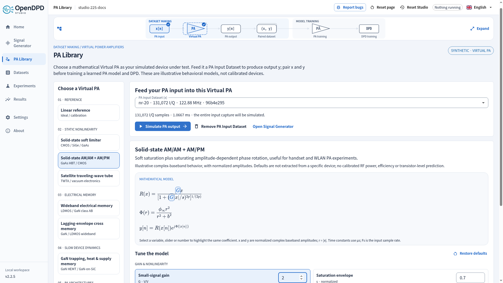

# Virtual PA Library

The **Virtual PA** is the simulated device under test. The **learned PA model**
is a neural or other fitted surrogate trained later on its input/output pairs.
Keeping these roles separate makes the provenance of every PA output explicit.

## Workflow

1. Generate a **PA Input Dataset**, x, in Signal Generator. It is not a complete
   training dataset. Download its I/Q CSV and metadata JSON independently.
2. Open **PA Library** and select a mathematical model. The technology labels
   describe illustrative applications, not device calibrations or foundry models.
3. Select a saved input. Adjust sliders or numeric fields; selecting a control
   highlights the matching variables in the displayed equations, and vice versa.
4. Click **Simulate PA output**. Inspect input/output AM/AM, AM/PM, envelope and
   spectrum, plus dynamic states where applicable. Output CSV, paired CSV and
   simulation metadata JSON are independent downloads.
5. Click **Create paired dataset & train PA**. This is the only new GUI step that
   registers the generated pair as trainable data. Then train the PA surrogate
   and use it as the reference for DPD training.

The diagram separates dataset making from model training. It stays compact while
scrolling and expands for inspection. Existing paired datasets bypass generation
and Virtual PA simulation, complete the entire dataset-making group, and open
PA Training directly. Training checkmarks require actual successful runs, matching
dataset versions and a matching PA reference. Returning to Signal Generator
restores the selected input instead of silently starting over.

## Model families

| Category | Virtual PA | Illustrative application and behavior |
| --- | --- | --- |
| Reference | Linear reference | Gain and fixed phase; alignment and pipeline checks |
| Static | Solid-state soft limiter | Rapp AM/AM saturation with adjustable knee; CMOS, SiGe or GaAs radio/array element |
| Static | Solid-state AM/AM + AM/PM | Rapp saturation plus saturating phase rotation; handset or WLAN CMOS/GaAs HBT experiments |
| Static | Satellite traveling-wave tube | Saleh rational amplitude/phase laws; TWTA/transponder experiments, including overdrive roll-off |
| Electrical memory | Wideband electrical memory | A separable fifth-order memory polynomial with decaying complex taps; LDMOS/GaN class AB bias/matching memory |
| Electrical memory | Lagging-envelope cross memory | Adds current-input × delayed-envelope-power terms; the causal lagging subset of GMP |
| Slow dynamics | GaN trapping, heat & supply memory | Asymmetric trap capture/release, temperature-dependent emission, effective heating and normalized IR drop for pulsed/TDD/radar studies |
| Architecture | Doherty-inspired two-path PA | Soft-limited carrier plus thresholded peaker, with path magnitude/phase mismatch |
| Architecture | Envelope-tracking supply PA | A finite-speed supply tracker changes saturation headroom, with supply floor, swing, IR drop, recovery and supply-sensitive AM/PM |

Defaults are illustrative. Different technologies can share a behavioral model;
select a family by the effect being studied. The Doherty construction does not
solve an impedance inverter or predict actual load modulation/efficiency.
Effective temperature, activation energy and normalized supply states are not a
calibrated transistor-physics simulation.

## Equations and units

The complete equations, parameter bounds, defaults, explanations and symbols
come from `opendpd/core/virtual_pa.py` and are included in each frozen simulation.
Studio 2.2.5 renders the catalog equations as LaTeX using bundled KaTeX and fonts. Parameter coefficients remain keyboard/click controls with dynamic highlighting. Rendering allows only the fixed parameter classes, with external links/resources and arbitrary styles disabled; no formula code is evaluated.
For example, the Rapp helper is

```
R(x; G,s,p) = G x / [1 + (G |x| / s)^(2p)]^(1/(2p)).
```

G is small-signal envelope gain, s is the soft-limiter ceiling and p controls knee
sharpness. The AM/PM extension uses `phi(r) = phi_inf r² / (r² + b²)`.
Every parameter control participates in the implemented equations.

All waveforms are complex baseband, with normalized amplitude. The sample clock
comes from x; RF carrier frequency remains metadata. No implicit resampling,
output normalization, gain fitting or added output noise takes place. Simulate
nonlinear spectral regrowth with adequate sample-rate headroom in the input;
this discrete-time envelope model does not recover aliased out-of-band products.

Time constants are entered in **microseconds** and converted by `10^-6` in the
displayed discrete-time pole, `a = exp(-1 / (Fs tau_us 10^-6))`. Electrical-memory
depth is an integer number of samples; its physical span is `M / Fs`. Dynamic
states start at zero before the first sample, and effective temperature starts at
ambient. The thermal state is an illustrative single-pole response to normalized
envelope power. The GaN release time follows

```
tau_e(T) = tau_e,25 exp[(Ea/kB) (1/(T_C + 273.15) - 1/298.15)].
```

Increase capture duration to observe slow recovery/settling. The UI reports when
selected slow time constants exceed the available input duration. Long memory
can persist across a later split guard: one continuous synthetic capture does not
constitute independent measurement conditions.

## Data, diagnostics and provenance

- One output for every input sample; both exports use float32 I/Q values with
  enough CSV digits to round-trip exactly. Output-only columns are `I,Q` and
  paired columns are `I_in,Q_in,I_out,Q_out`.
- Preview metrics use every exported sample: RMS, sample-power PAPR and RMS gain.
  Welch spectra use at most 2,048 samples per segment, 50% overlap, density scaling,
  and no detrending. Amplitudes are not calibrated watts or dBm.
- Envelope, state and AM/AM–AM/PM plots select up to 1,536 regularly spaced time
  samples for display. They do not resolve every waveform peak. Phase points with
  negligible input amplitude are excluded; no gain/phase fitting is applied.
- Changing input or parameters invalidates the current output and downstream
  pairing/training selection. Invalid numeric drafts cannot be simulated.
- Saved `pa_simulations/vpa-<sha>/` records bind input bytes, full parameters,
  sample rate and simulator source hash. They contain the model description and
  formulas, output hash and diagnostic arrays. Output bytes are checked before
  download or pairing. Pairing consumes a frozen simulation, not a hidden rerun.
- The paired manifest includes both input/output hashes, waveform configuration,
  Virtual PA formula/parameters, source hash and `physical_measurement: false`.
  The ordinary contiguous split protocol remains unchanged. Fractions apply to
  `N - 2 × guard`, with rounding remainder assigned to testing.
- Data stays private unless the user separately initiates a dataset contribution.
  Public contributions require human merge review; contact **emi.lab@outlook.com**.

## Modeling references

The simplified families above draw on these behavioral-model concepts; they are
not claimed to reproduce the measured devices or complete models in the papers.

- [Saleh, Frequency-Independent and Frequency-Dependent Nonlinear Models of TWT Amplifiers (1981)](https://doi.org/10.1109/TCOM.1981.1094911): rational AM/AM and AM/PM model family.
- [Morgan et al., A Generalized Memory Polynomial Model for Digital Predistortion of RF Power Amplifiers (2006)](https://doi.org/10.1109/TSP.2006.879264): memory-polynomial and cross-envelope model family. This implementation uses constrained/separable taps and causal lagging terms.
- [Keysight, Amplifier Memory Effects](https://www.keysight.com/us/en/assets/7018-02538/application-notes/5990-5799.pdf): behavioral memory and distortion background.
- [The Impact of Long-Term Memory Effects on the Linearizability of GaN HEMT-Based Power Amplifiers (2022)](https://ieeexplore.ieee.org/document/9658162/), and [A Multiple-Time-Scale Analog Circuit for the Compensation of Long-Term Memory Effects in GaN HEMT-Based PAs (2020)](https://ieeexplore.ieee.org/document/9143297/): trapping, recovery and temperature coupling motivate the slow-state demonstration.
- [Keysight, Envelope Tracking Concept](https://helpfiles.keysight.com/csg/n7614/Content/Main/Envelope%20Tracking%20Concept.htm): envelope-dependent supply behavior.

## Verification

Numerical tests check every parameter's actual effect, formula/control binding,
causality, zero input, deterministic replay, analytic gain/saturation, memory-tap
response and physical-time consistency. API tests cover input-only isolation,
exact pairing, hashes, frozen parameters, unchanged splits, real CPU PA/DPD jobs,
feature gating and public-session isolation. Frontend tests cover linked controls,
invalidated previews, explicit pairing and existing-dataset bypass. The browser
script `scripts/verify_signal_generator.mjs` exercises real downloads and workers.

## Studio 2.2.5 preview



The output preview draws **PA Input** and **PA Output** PSDs separately on matching initial dB scales. Independent controls enlarge or zoom each location. The paired dataset remains synthetic when used to learn a PA surrogate or DPD model. See [signal-chain spectra](signal-chain-spectra.md).

The input selector and **Simulate PA output** control sit above the mathematical parameters. After simulation, dataset creation appears above the output charts. **Remove PA Input Dataset** hides only the selected input from this workspace's picker; Undo restores it. Existing simulation sources and paired datasets remain intact. For linearization experiments after forward-model training, continue to [ILC and ILA DPD](ilc-dpd.md).
