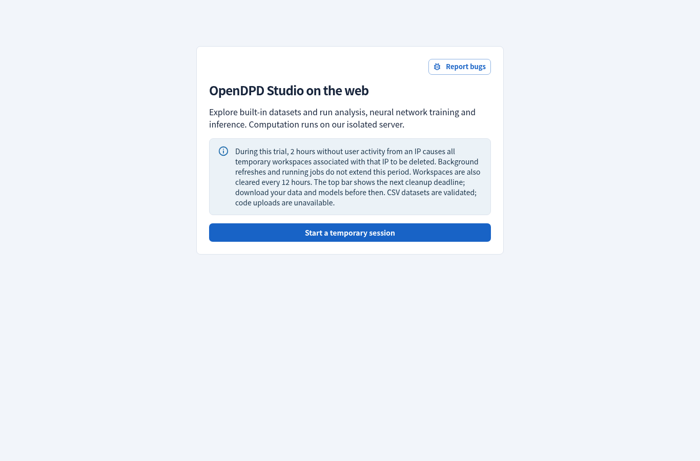

# Studio 2.2.8 performance and inactivity validation

Date: 2026-09-15. Compare 2.2.7 and 2.2.8 builds on the same development host.
Browser checks use Chromium, separate contexts, a real loopback ASGI API and
disposable workspaces. The inactivity check advances a private harness clock;
the application and production deployment contain no clock-control endpoint.

| Measurement | 2.2.7 | 2.2.8 |
|---|---:|---:|
| Initial Home JavaScript + CSS, decoded bytes | 1,451,883 | 823,598 |
| Initial JavaScript, gzip bytes | 417,272 | 261,674 |
| Idle Home API requests over 65 seconds, after startup | 12 | 4 |
| SQLite count statements for a cold status read with 256 empty workspaces | 768 | 0 |
| 10,000 authentication calls with 1,024 waiting tickets | 267.27 ms | 16.90 ms |
| RSS with 256 empty workspaces and 1,024 tickets | 227.16 MiB | 227.38 MiB |
| Public background threads | 2 | 2 |

Initial resources include every recursive static JavaScript import and CSS,
confirmed by actual browser resource entries. Gzip totals compress each file
separately with Python's default gzip settings; production compression can
differ. This is **43.3% less initial decoded JavaScript/CSS**, **37.3% less
compressed JavaScript**, and **66.7% fewer idle Home requests** in this case.
Dynamic route chunks move work to the page that needs it; they do not disappear.
The split initial code uses more individual requests (11 versus 2).

The HTTP benchmark also exercises 256 admissions, 1,024 FIFO tickets, overflow
rejection and 100 status requests at concurrency eight. Raw latency and CPU
samples are included below, not used as an Internet latency claim. These single
host observations are sensitive to other host activity; a frontend build ran
alongside the first candidate benchmark. A subsequent sequential repeat gave
status-read p95 values of 30.19 ms (2.2.7) and 30.55 ms (2.2.8), with the same
768-to-zero SQLite reduction and authentication totals of 268.73 versus 7.01 ms.
These checks do not establish better throughput or
256 simultaneous training jobs. Compute, storage and heavy-operation limits
remain unchanged.

## Correctness checks

The focused 59-test backend run covers shared-IP expiry/renewal, IPv6 /64
grouping, polling that cannot renew, no expired-session revival, waiting-room
admission after cleanup, independent credentials, cross-origin rejection and
job-count failures that remain unknown. Real training verifies queued counts.
Two concurrency tests hold worker shutdown or file deletion open while another
visitor completes an HTTP request.

The full Python regression passes: **953 tests**, with 19 extended tests deselected.
All 246 frontend tests pass, including event coalescing, no untouched-tab
keepalive, hidden tabs, abort on unmount, no retry loop after activity failure,
server-clock skew, same-IP renewal and credential retention on network failure.
Type checking and lint pass. The keyboard journey also covers a two-second
route-load delay; it waits for the actual Overview tab before bounded keyboard
traversal. That delayed journey passes five repeated Firefox runs.

The actual browser journey verifies foreground renewal across two workspaces
from one IP, another IP's independent deadline, read polls that cannot renew,
revocation and deletion at the two-hour boundary, rechecking a shared deadline
and returning to the trial prompt after expiry. No browser runtime errors were
observed. A separate real-API route journey generated four signal plots, loaded
PA Library LaTeX and visited Experiments, Results, Server load, Settings and About.
The start prompt fits 1366- and 390-pixel viewports without horizontal
overflow. This controlled clock test is separate from the production rollout.



## Reproducible evidence

- [Build resources](studio-2.2.8/bundles.json)
- [Browser resource entries and idle requests](studio-2.2.8/browser-performance.json)
- [Browser inactivity checks](studio-2.2.8/inactivity.json)
- [Lazy routes and real generation](studio-2.2.8/routes.json)
- [2.2.7 admission baseline](studio-2.2.8/admission-before.json)
- [2.2.8 admission measurement](studio-2.2.8/admission-after.json)
- [Sequential 2.2.7 repeat](studio-2.2.8/admission-before-repeat.json)
- [Sequential 2.2.8 repeat](studio-2.2.8/admission-after-repeat.json)

Reproduce the admission workload with:

```sh
PYTHONPATH=. python scripts/benchmark_web_admission.py --output /tmp/admission.json
```

Build both revisions with the same dependency lock, web mode, API origin and
relative Vite base path. Sum the entry manifest's recursive static imports;
exclude dynamic imports until their route or chart opens. The idle comparison
uses a fresh empty Home view, waits for startup requests to finish, then records
65 seconds of API traffic without input. Foreground activity reports may add at
most one request per minute while the visitor interacts.

Deployment and public CUDA checks are recorded with the
[2.2.8 release](https://github.com/lab-emi/OpenDPD/releases/tag/v2.2.8).
