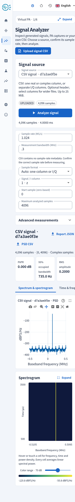

# Studio 2.2.9 validation

Date: 2026-09-15. Local Linux x86-64, Python 3.13.14, NumPy 2.4.4. Numeric tests use two-thread library limits. Measurements are development-host observations, not Internet response-time or concurrent-user guarantees.

## Analysis limits and measurements

One million complex samples, 4,096-point Hann Welch PSD, 50% overlap and all analyzer views took 0.122 s on the first call and a 0.102 s median across three subsequent calls. Peak process RSS was 248.5 MiB, including imports and input allocation; it is not incremental request memory. JSON visualization data was 1,216,614 bytes. The spectrogram retained 128 × 256 cells; time retained 2,048 contiguous samples and scatter 4,096 samples. All scalar statistics used the entire selected window. [Raw measurements](studio-2.2.9/analyzer.json).

The analyzer route and chart libraries load on demand. The spectrogram uses bounded canvas pixels and does not add another plotting library. Uploads have independent limits of 25 MiB, one million rows and two million numeric fields. Upload validation, analysis and source-catalog reads share public compute admission; status and cancellation retain capacity.

## Correctness and browser checks

The full Python regression passes **994 tests**, with 19 extended tests deselected. A subsequent focused run passes **118 tests**, covering the final signal-source role checks and updated numerical identity. The frontend passes **249 tests in 58 files**; strict types, lint and generated API contracts pass.

Real Chromium checks against the loopback API cover generation, exact sample-rate handoff, all five analyzer views, expanded spectrogram, LaTeX definitions and downloaded report hashes. Real, single-column complex and split I/Q CSVs each analyze 4,096 samples. The real tone measures 3.01029995664 dB PAPR; both complex forms measure 0 dB. The exercised analyzer page has zero axe WCAG 2.1 AA violations and no JavaScript runtime errors. A 390 × 844 viewport fits without horizontal scrolling. These are automated Linux browser checks, not a Safari/native-window certification.

Analytic tests cover tone units, full-band fractional-bin integration, unavailable adjacent bands, zero inputs, aligned-reference gain fitting, non-destructive processing, finite statistics, explicit Gray alphabets, RRC length, DFT zero bins and repeatable new modulation families.

## Security review

The three analyzer routes are explicitly allowed. Authentication, origin/CSRF checks, workspace-local source lookup, numeric quarantine, full-file validation, hash verification, upload deletion on failure, shared work admission and per-IP limits are exercised. Tests reject cross-workspace identifiers, traversal, incorrect PA roles, malformed/oversized fields and loss of complex components. Analyzer requests do not execute uploaded code or create paired datasets. Public analysis does not reserve disk for report files because the report is returned directly.

NR/WLAN presets remain continuous uncoded engineering signals. Diagnostics do not claim complete protocol frames, demodulation, spectral-mask compliance or standard EVM. Wi-Fi 8 is experimental. Existing native-platform and hardware limitations remain in the [support matrix](../releases/support-matrix.md).

[Browser evidence](studio-2.2.9/browser.json) · [New custom families](studio-2.2.9/custom.json)

