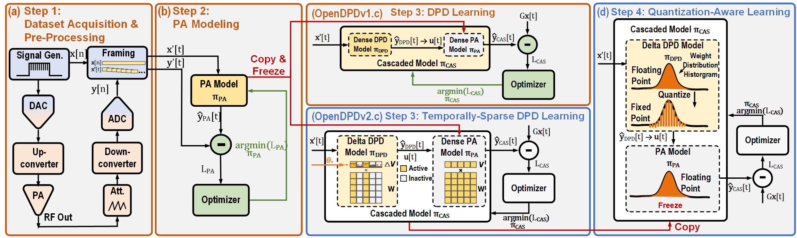

# PA modeling and DPD training

For a first experiment, follow the [Studio walkthrough](tutorials/gui-quickstart.md) or the [workspace CLI guide](tutorials/headless-cli.md). This page explains the learning pipeline and the original research commands, which remain available as `python main.py` and `opendpd-cli`.

## How the pipeline works



1. **Prepare paired I/Q data.** Each complex input sample has a time-aligned measured PA output. Training, validation and test data have distinct roles; framing happens within their boundaries. Use the dataset's recorded splits rather than assuming one ratio for every dataset. See [dataset formats](datasets.md) and the [split protocol](protocols/dataset-doctor.md#split-protocol-contiguous-v1).
2. **Learn the PA response.** A behavioral model predicts the measured output from the input. Recurrent models learn from sequences using backpropagation through time.
3. **Learn a predistorter.** Put a trainable DPD model before the fitted PA model. Gradients pass through the frozen PA model to optimize the DPD against the linear reference.
4. **Evaluate and export.** Score held-out data and inspect the waveforms and spectra. Exported `u = DPD(x)` is an input for the physical PA; the surrogate's `PA(u)` is a simulated output.

A good surrogate result does not establish measured PA performance. For hardware validation, follow the [measured DPD guide](tutorials/measured-dpd.md). Metric definitions and comparability rules live in [metric profiles](protocols/metric-profiles.md).

## Original CLI: train, apply, plot

Run these commands in order from the repository root after [installation](install.md). This example uses the built-in `DPA_200MHz` dataset on CPU and the original default models:

```bash
python main.py --dataset_name DPA_200MHz --step train_pa --accelerator cpu
python main.py --dataset_name DPA_200MHz --step train_dpd --accelerator cpu
python main.py --dataset_name DPA_200MHz --step run_dpd --accelerator cpu
python main.py --dataset_name DPA_200MHz --step plot --accelerator cpu
```

For an installed core package, substitute `opendpd-cli` for `python main.py`. Use `--accelerator cuda` or `--accelerator mps` only with a working backend on your machine. The defaults are research runs; use the workspace CLI's smoke recipes for a shorter first check.

The original pipeline writes checkpoints under `save/`, logs under `log/` and predistorted I/Q CSVs under `dpd_out/`. The workspace service runs this same pipeline inside each run directory and records the resolved configuration and provenance. See the [CLI artifact table](tutorials/headless-cli.md#2-run-a-reference-recipe).

When changing a model, keep the PA checkpoint, dataset, seed and framing settings consistent between stages. Studio and `opendpd run` validate these references for you. Query `opendpd models` for the current registry and `opendpd recipes` for preset experiments; the [model guide](tutorials/adding-a-model.md) explains how backbones are registered.

## Classical baselines

The workspace recipes `pa-mp-ls-v1`, `pa-gmp-ls-v1`, `dpd-mp-ila-v1` and
`dpd-gmp-ila-v1` fit memory-polynomial baselines on CPU. PA fits use direct
least squares on the training split; DPD fits use indirect learning (ILA)
and are evaluated through a gradient-trained PA surrogate.

These fits have no training epochs or random seed. Their results record retained
rank, condition number, singular-value cutoff (`rcond`) and train residual in
`fit.json`. The result names its training path so comparisons remain explicit.
A least-squares PA is a modeling reference and cannot be selected as the DPD
simulation surrogate. See the [benchmark protocol](protocols/benchmark-protocol.md)
for comparisons under a shared budget and reference.

## Quantization-aware training

Quantization-aware training fine-tunes a compatible DPD model with fixed-point weight and activation constraints. First train the **float model of the same quantization-capable backbone**:

```bash
python main.py --dataset_name DPA_200MHz --step train_dpd --accelerator cpu --DPD_backbone qgru
```

Then set `FLOAT_CHECKPOINT` to that run's actual `DPD_*_M_QGRU_*.pt` checkpoint under `save/`. The following is a shell template; replace the path before running it:

```bash
FLOAT_CHECKPOINT="/path/to/float-qgru-checkpoint.pt"
python main.py --dataset_name DPA_200MHz --step train_dpd --accelerator cpu --DPD_backbone qgru --quant --n_bits_w 16 --n_bits_a 16 --pretrained_model "$FLOAT_CHECKPOINT" --quant_dir_label w16a16
python main.py --dataset_name DPA_200MHz --step run_dpd --accelerator cpu --DPD_backbone qgru --quant --n_bits_w 16 --n_bits_a 16 --quant_dir_label w16a16
```

Keep the backbone, bit widths and label consistent when applying the quantized checkpoint. For paper-specific settings use the [reproduction scripts](reproducing.md); for a checked fixed-point C99 package see [deployment export](tutorials/deployment-export.md).

## Inspect training

Studio shows live task metrics, signal comparisons and worker output; see [visualization](visualization.md). In the original CLI, Rich tables display run information and train/validation/test metrics. Set their precision with `--log_precision`:

```bash
python main.py --dataset_name DPA_200MHz --step train_pa --log_precision 4
```

Python users can call `train_pa`, `train_dpd`, `run_dpd` and `plot_dpd`; see the [examples](examples.md) and [API reference](api.md).
